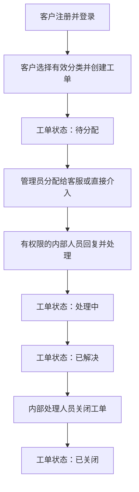

# 企业售后工单系统 产品需求文档（PRD）

| 项目 | 内容 |
| --- | --- |
| 文档版本 | v1.0（已确认版） |
| 产品阶段 | 最小可行产品（MVP）规划 |
| 编制依据 | 《企业售后工单系统 产品与技术规范 v1.0》 |
| 当前状态 | 已经用户确认，作为后续需求细化与设计工作的产品基线 |
| 编制日期 | 2026-05-26 |

## 1. 文档目的

本文档定义企业售后工单系统最小可行产品（MVP）的产品目标、服务对象、角色价值、功能范围、核心流程、版本边界、验收目标及后续迭代路线。其用途是统一产品理解，为后续编制软件需求规格说明书（SRS）、页面与交互说明、技术设计和实施计划提供产品层依据。

本文档不展开字段长度、接口参数、存储结构、详细异常处理、页面控件规则或测试用例等实现级内容；这些内容应在后续专项文档中细化并确认。

## 2. 产品概述

### 2.1 产品背景

企业在为外部客户提供售后支持时，需要一个统一渠道承接问题、明确负责人员、保留沟通记录并追踪处理结果。MVP 面向个人客户的简单售后场景，先以可运行、可演示、可验证的闭环系统替代分散或不可追踪的处理方式。

### 2.2 产品定位

本产品是一套面向外部个人客户的售后工单系统。客户通过网页门户注册、登录并提交问题；管理员负责基础配置、账号管理与工单分配；客服负责处理指定工单并与客户公开沟通。产品首期服务于小规模本地演示和试用，不以生产级规模和完整客服运营能力为目标。

### 2.3 产品愿景

先建立清晰可靠的客户问题处理闭环，再基于真实操作数据提升管理可见性与客服工作效率，最终演进为具备正式运行基础的售后支持系统。

## 3. 产品目标与非目标

### 3.1 MVP 目标

| 编号 | 目标 |
| --- | --- |
| G-01 | 为个人客户提供统一的在线售后问题提交与进展查看入口。 |
| G-02 | 使管理员能够配置分类、管理必要账号并将工单明确分配给客服。 |
| G-03 | 使负责客服能够基于工单与客户沟通，并推进问题至关闭。 |
| G-04 | 保存工单、留言及关键处理操作记录，使处理过程可追溯。 |
| G-05 | 验证可演进的数据访问架构，为后续真实数据库接入提供基础。 |

### 3.2 MVP 非目标

MVP 不以以下能力为交付目标：

- 不提供企业客户组织、多人共享客户账号或多租户服务能力。
- 不提供附件、邮件、短信或第三方消息通知。
- 不提供服务级别协议（SLA）、超时预警、升级处理或质量考核。
- 不提供统计看板、高级搜索、多条件筛选、批量操作或工单导出。
- 不提供客户确认关闭、取消、退回、重开或自动关闭流程。
- 不以正式生产部署、高并发处理或完善运维能力为目标。

## 4. 目标用户与角色价值

### 4.1 客户

客户为需要向企业寻求售后支持的外部个人用户。其核心诉求是能够方便地提交问题，在统一页面中持续了解处理状态，并与处理人员进行可回溯的沟通。

MVP 为客户提供：

- 自助注册与基础登录、退出。
- 创建包含标题、问题描述和问题分类的售后工单。
- 查看本人创建的工单列表及详情。
- 在本人工单中查看并追加公开留言。
- 查看工单当前处理状态与回复结果。

### 4.2 客服

客服为承担售后问题处理工作的内部人员。其核心诉求是识别自己需要处理的问题、与客户保持沟通并完成闭环。

MVP 为客服提供：

- 登录内部工作页面。
- 查看全部工单列表并按状态进行基础筛选。
- 查看工单详情和既有公开留言。
- 对分配给本人的工单进行回复与状态推进。

### 4.3 管理员

管理员为系统基础管理与工单调度负责人。其核心诉求是建立可运转的受理秩序，配置分类和内部人员，并确保工单有人处理。

MVP 为管理员提供：

- 初始化管理员身份后登录系统。
- 新建、编辑、停用问题分类。
- 创建客服账号。
- 查看客户账号，并禁用或重新启用客户账号。
- 查看工单并手动分配或重新分配负责人。
- 直接介入任意工单的回复和状态处理。

## 5. 核心使用场景

### 5.1 客户提交售后问题

客户完成注册并登录后，选择当前有效的问题分类，填写标题和问题描述并提交工单。系统为其建立一条初始处于“待分配”状态的工单，客户能够在自己的工单列表中查看该记录。

### 5.2 管理员组织受理

管理员进入后台查看新产生的待分配工单，根据问题内容将工单分配给某位客服。管理员也可以在必要时直接回复或处理工单，而不必等待客服接手。

### 5.3 客服与客户沟通并完成处理

收到分配的客服进入工单详情，与客户通过公开留言交换信息，并依次推进处理状态。客户在工单处理期间能够查看状态并补充留言。当问题完成处理后，由负责客服或管理员将工单关闭。

### 5.4 管理员维护运行基础

管理员可维护问题分类，使客户只能选择有效分类提交问题；管理员可创建客服账号，并可在必要时禁用客户账号，以保障试用期间系统具备基本管理秩序。

## 6. MVP 功能需求

### 6.1 账号与身份认证

| 编号 | 功能需求 | 适用角色 | 优先级 |
| --- | --- | --- | --- |
| FR-AUTH-01 | 系统应允许个人客户开放注册账号。 | 客户 | 必须 |
| FR-AUTH-02 | 系统应允许客户、客服和管理员通过账号及密码登录，并支持退出。 | 全部角色 | 必须 |
| FR-AUTH-03 | 系统应支持初始化管理员，以开展首次配置和内部账号创建。 | 管理员 | 必须 |
| FR-AUTH-04 | 系统应允许管理员创建客服账号，客服不得自行注册。 | 管理员、客服 | 必须 |
| FR-AUTH-05 | 系统应允许管理员查看客户账号，并禁用或启用客户账号。 | 管理员、客户 | 必须 |
| FR-AUTH-06 | 被禁用客户不得继续登录或提交新工单，其历史工单数据应保留。 | 客户、管理员 | 必须 |

### 6.2 问题分类管理

| 编号 | 功能需求 | 适用角色 | 优先级 |
| --- | --- | --- | --- |
| FR-CAT-01 | 系统应允许管理员新增问题分类。 | 管理员 | 必须 |
| FR-CAT-02 | 系统应允许管理员编辑或停用已有问题分类。 | 管理员 | 必须 |
| FR-CAT-03 | 客户创建工单时仅能选择当前有效的问题分类。 | 客户 | 必须 |

### 6.3 工单创建与查看

| 编号 | 功能需求 | 适用角色 | 优先级 |
| --- | --- | --- | --- |
| FR-TKT-01 | 客户应能创建包含标题、问题描述和问题分类的工单。 | 客户 | 必须 |
| FR-TKT-02 | 新创建的工单应进入“待分配”状态。 | 客户、内部人员 | 必须 |
| FR-TKT-03 | 客户仅能查看本人创建的工单列表与详情。 | 客户 | 必须 |
| FR-TKT-04 | 客服和管理员应能查看全部工单列表与工单详情。 | 客服、管理员 | 必须 |
| FR-TKT-05 | 内部工单列表应支持按状态进行基础筛选。 | 客服、管理员 | 必须 |

### 6.4 工单分配与处理

| 编号 | 功能需求 | 适用角色 | 优先级 |
| --- | --- | --- | --- |
| FR-HDL-01 | 管理员应能将工单手动分配给指定客服，并能重新分配。 | 管理员 | 必须 |
| FR-HDL-02 | 分配给指定客服的工单，仅该客服和管理员可进行处理操作。 | 客服、管理员 | 必须 |
| FR-HDL-03 | 未被指定为负责人的客服可查看工单，但不能回复或修改状态。 | 客服 | 必须 |
| FR-HDL-04 | 管理员可直接回复并处理任意工单。 | 管理员 | 必须 |
| FR-HDL-05 | 工单状态应遵循“待分配 -> 处理中 -> 已解决 -> 已关闭”的闭环流程。 | 客服、管理员 | 必须 |
| FR-HDL-06 | 工单关闭由有处理权限的内部人员执行，无需客户确认。 | 客服、管理员、客户 | 必须 |

### 6.5 工单公开沟通与过程记录

| 编号 | 功能需求 | 适用角色 | 优先级 |
| --- | --- | --- | --- |
| FR-MSG-01 | 客户应能在本人未关闭工单内查看和追加公开留言。 | 客户 | 必须 |
| FR-MSG-02 | 负责客服和管理员应能在可处理工单中发送公开留言。 | 客服、管理员 | 必须 |
| FR-MSG-03 | 公开留言应对该工单客户及可查看该工单的内部人员可见。 | 全部角色 | 必须 |
| FR-LOG-01 | 系统应保留工单创建时间、当前状态与当前负责人信息。 | 系统 | 必须 |
| FR-LOG-02 | 系统应记录留言发送人和发送时间。 | 系统 | 必须 |
| FR-LOG-03 | 系统应记录分配、重新分配和状态变化的操作人及时间。 | 系统 | 必须 |

## 7. 核心业务流程

### 7.1 售后工单处理主流程

### 7.2 工单状态定义

| 状态 | 产品含义 | 主要处理角色 |
| --- | --- | --- |
| 待分配 | 客户已经提交问题，等待管理员确定负责客服或介入处理。 | 管理员 |
| 处理中 | 内部人员已经开始处理问题，并可与客户公开沟通。 | 负责客服、管理员 |
| 已解决 | 内部人员认为问题已经获得解决结果，等待执行闭环关闭。 | 负责客服、管理员 |
| 已关闭 | 工单处理完成并结束，MVP 不支持重新开启。 | 负责客服、管理员 |

## 8. 权限范围概览

| 能力 | 客户 | 客服 | 管理员 |
| --- | --- | --- | --- |
| 开放注册客户账号 | 可操作 | 不可操作 | 不可操作 |
| 登录与退出 | 可操作 | 可操作 | 可操作 |
| 创建工单 | 可操作 | 不可操作 | 不可操作 |
| 查看本人工单 | 可操作 | 不适用 | 可查看全部 |
| 查看全部工单 | 不可操作 | 可操作 | 可操作 |
| 按状态筛选内部工单 | 不可操作 | 可操作 | 可操作 |
| 公开留言 | 仅本人未关闭工单 | 仅本人负责工单 | 任意工单 |
| 推进工单状态 | 不可操作 | 仅本人负责工单 | 任意工单 |
| 分配或重新分配工单 | 不可操作 | 不可操作 | 可操作 |
| 维护问题分类 | 不可操作 | 不可操作 | 可操作 |
| 创建客服账号 | 不可操作 | 不可操作 | 可操作 |
| 启用/禁用客户账号 | 不可操作 | 不可操作 | 可操作 |

详细的授权检查点、状态操作约束和异常反馈应在软件需求规格说明书中进一步定义。

## 9. 页面范围

### 9.1 客户门户

| 页面 | 核心目的 | MVP 包含的能力 |
| --- | --- | --- |
| 注册页 | 建立个人客户账号 | 输入注册信息并创建账号 |
| 登录页 | 进入系统 | 登录、退出后的重新登录入口 |
| 我的工单页 | 查看个人问题记录 | 显示本人创建的工单 |
| 新建工单页 | 提交售后问题 | 选择分类，填写标题和问题描述 |
| 工单详情页 | 追踪与沟通 | 查看状态和留言、追加公开留言 |

### 9.2 内部后台

| 页面 | 核心目的 | MVP 包含的能力 |
| --- | --- | --- |
| 工单列表页 | 集中查看待处理工作 | 查看全部工单、按状态筛选 |
| 工单详情页 | 分派与处理问题 | 查看内容、留言、分配和状态操作 |
| 分类管理页 | 维护客户可选问题分类 | 新增、编辑、停用分类 |
| 客服账号管理页 | 建立处理团队账号 | 创建和查看客服账号 |
| 客户账号管理页 | 管理客户访问资格 | 查看、禁用与启用客户账号 |

具体布局、输入交互、导航关系、空状态和错误提示在《页面与交互说明》中定义。

## 10. 产品约束与质量要求

### 10.1 业务与范围约束

- 产品首期仅面向外部个人客户，不支持客户组织维度的数据共享。
- 首期以本地运行和小规模试用为目标，预期客户不超过 100 人、客服不超过 5 人。
- 工单仅使用一级问题分类，不纳入多级分类体系。
- 首期沟通仅通过门户内公开留言完成，不提供外部通知。

### 10.2 产品质量底线

| 编号 | 要求 |
| --- | --- |
| QR-01 | 用户只能访问其角色与业务范围允许查看的数据和操作。 |
| QR-02 | 密码不得以明文方式保存。 |
| QR-03 | 服务重启后，客户、账号、分类、工单、留言和操作记录数据不得因重启丢失。 |
| QR-04 | 工单的关键处理过程应可通过状态、留言和操作记录追溯。 |
| QR-05 | 数据持久化方案应允许未来替换为关系型数据库，而不改变核心产品流程。 |

更具体的安全、数据一致性、兼容性及可测试性要求在 SRS 与技术设计文档中细化。

## 11. MVP 验收目标

MVP 应通过可演示的完整业务路径证明产品闭环成立：

| 编号 | 验收目标 |
| --- | --- |
| AC-01 | 客户可以完成注册、登录并提交含有效分类、标题和问题描述的新工单。 |
| AC-02 | 客户只能访问自己的工单，并能够查看和补充公开留言。 |
| AC-03 | 管理员可以创建客服账号、维护分类、管理客户启停状态。 |
| AC-04 | 管理员可以将待分配工单交给指定客服处理，或自行介入处理。 |
| AC-05 | 指定客服可以公开回复并依次完成工单状态闭环。 |
| AC-06 | 非负责人客服可以查看工单，但不能回复或推进该工单。 |
| AC-07 | 留言、分配与状态变化保留操作人和时间记录。 |
| AC-08 | 系统服务重启后，业务数据仍然存在。 |
| AC-09 | 密码安全保存、访问权限与关键流程能够通过测试验证。 |

## 12. 迭代规划

| 版本阶段 | 产品目标 | 主要能力 |
| --- | --- | --- |
| MVP | 建立可演示的个人客户售后闭环 | 账号、分类、工单提交、手动分配、公开留言、状态闭环、基础记录 |
| 迭代 1 | 提升管理可见性 | 工单总量、状态和分类分布、客服处理量、处理时长统计看板 |
| 迭代 2 | 提升客服操作效率 | 多条件筛选、关键词搜索；依据实际使用情况扩展快捷回复、批量操作或导出 |
| 迭代 3 | 支持正式日常运行 | 真实关系型数据库、数据迁移、部署配置、备份恢复和账号安全增强 |

第三轮之后的产品路线不在本 PRD 中预排优先级，应根据实际试用反馈和运行数据另行决策。

## 13. 后续文档衔接

本 PRD 经确认后，将作为以下文档的产品需求输入：

| 后续文档 | 需要进一步定义的内容 |
| --- | --- |
| 软件需求规格说明书（SRS） | 详细业务规则、字段约束、权限检查、状态转换、异常流程和非功能需求 |
| 页面与交互说明 | 页面结构、操作步骤、导航、反馈提示和界面原型 |
| 技术设计说明书 | 系统模块、认证方式、仓储抽象、持久化、部署和测试策略 |
| 数据模型设计 | 实体字段、标识符、关系和操作记录模型 |
| 接口设计 | 接口路径、请求响应、鉴权规则及错误码 |
| 测试与验收方案 | 可执行的功能、权限、流程、安全和持久化测试用例 |
| MVP 实施计划 | 开发阶段、任务顺序、依赖、里程碑和交付物 |

## 14. 已确认事项

本文基于已确认的产品与技术规范编制，未主动增加 MVP 功能范围。以下内容已经用户确认：

1. 本文对产品目标、用户角色价值与 MVP 非目标的表达是否准确。
2. 功能需求清单是否完整体现已确认的 MVP 能力和权限边界。
3. 产品级验收目标与后续三轮迭代顺序是否可以作为后续 SRS 编制依据。

## 15. 确认记录

| 日期 | 确认人 | 结果 | 备注 |
| --- | --- | --- | --- |
| 2026-05-26 | 用户 | 已确认 | 本文档可作为后续软件需求规格说明书（SRS）及相关设计文档的产品基线。 |
