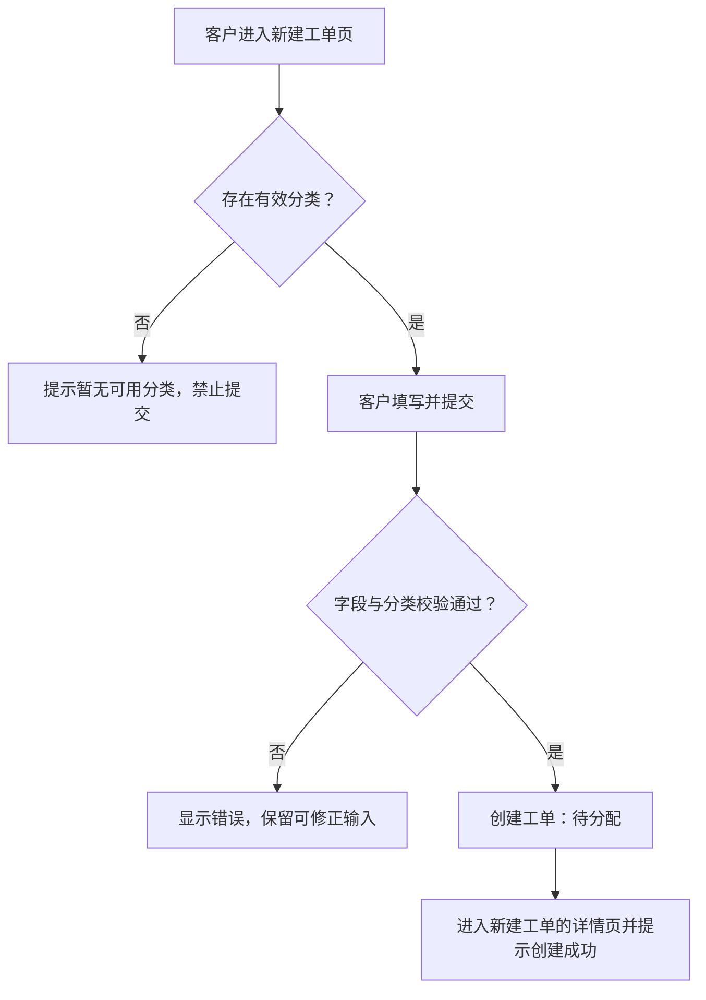
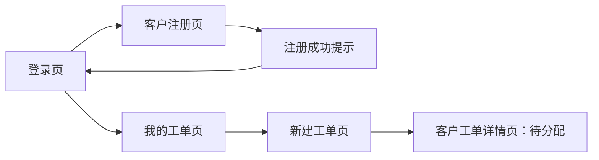
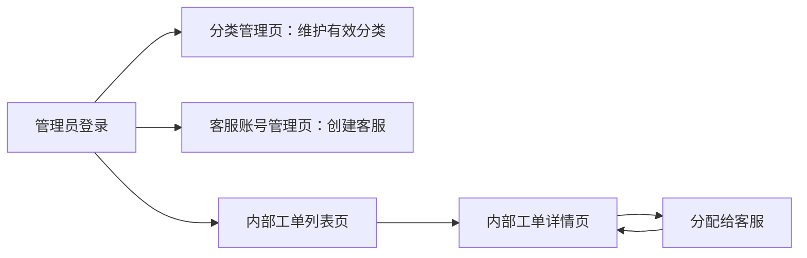
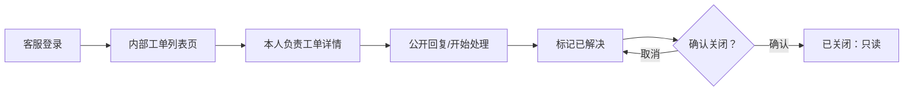

# 企业售后工单系统 页面与交互说明

| 项目 | 内容 |
| --- | --- |
| 文档版本 | v1.0（已确认版） |
| 适用版本 | 最小可行产品（MVP） |
| 文档性质 | 需求级页面与交互说明 |
| 编制依据 | 《企业售后工单系统 产品需求文档（PRD）v1.0》、《企业售后工单系统 软件需求规格说明书（SRS）v1.0》 |
| 当前状态 | 已经用户确认，作为界面设计、接口设计与验收规划的交互需求基线 |
| 编制日期 | 2026-05-26 |

## 1. 文档目的与范围

本文档定义最小可行产品（MVP）中客户门户与内部后台的页面结构、访问角色、页面间导航、展示信息、操作入口、输入反馈、权限表现和关键业务场景的交互结果。本文档旨在将已确认需求转换为可理解、可评审和可进一步设计的界面交互要求。

本文档不定义视觉品牌、颜色字体、像素级排版、响应式布局细节、前端文件结构、接口地址或实现技术方案。后续实现可以在满足本文业务交互要求的基础上选择简洁的界面呈现方式。

## 2. 交互设计原则

| 编号 | 原则 | 说明 |
| --- | --- | --- |
| UI-P01 | 角色清晰 | 登录后应让用户明确当前身份；客户入口与内部工作入口不得混淆。 |
| UI-P02 | 操作与权限一致 | 页面只向用户呈现其可能执行的主要操作；后端仍负责最终权限校验。 |
| UI-P03 | 流程可理解 | 工单当前状态、下一步可执行操作和处理结果应清晰展示。 |
| UI-P04 | 反馈及时 | 创建、分配、状态更新、留言及账号/分类维护完成或失败后，应提供明确反馈。 |
| UI-P05 | 防止误操作 | 禁用客户、停用分类、关闭工单等影响较大的操作，应在执行前提示确认。 |
| UI-P06 | 保持 MVP 简洁 | 不引入附件、通知、统计、复杂筛选或未纳入需求基线的交互入口。 |

## 3. 信息架构与角色入口

### 3.1 页面清单

| 页面编号 | 页面名称 | 访问角色 | 主要用途 |
| --- | --- | --- | --- |
| UI-PUB-01 | 登录页 | 未登录用户 | 统一身份登录入口 |
| UI-PUB-02 | 客户注册页 | 未登录用户 | 创建客户账号 |
| UI-CUS-01 | 我的工单页 | 客户 | 查看本人创建的工单 |
| UI-CUS-02 | 新建工单页 | 客户 | 提交新的售后问题 |
| UI-CUS-03 | 客户工单详情页 | 客户 | 查看状态、描述与公开留言，追加留言 |
| UI-INT-01 | 内部工单列表页 | 客服、管理员 | 查看全部工单并按状态筛选 |
| UI-INT-02 | 内部工单详情页 | 客服、管理员 | 查看处理信息、留言、操作记录并按权限处理 |
| UI-ADM-01 | 分类管理页 | 管理员 | 新增、编辑、停用或启用分类 |
| UI-ADM-02 | 客服账号管理页 | 管理员 | 查看并创建客服账号 |
| UI-ADM-03 | 客户账号管理页 | 管理员 | 查看并启用/禁用客户账号 |

### 3.2 登录后导航

| 登录角色 | 登录成功落地页 | 可见主导航 |
| --- | --- | --- |
| 客户 | 我的工单页 | 我的工单、新建工单、退出 |
| 客服 | 内部工单列表页 | 工单列表、退出 |
| 管理员 | 内部工单列表页 | 工单列表、分类管理、客服账号、客户账号、退出 |

### 3.3 页面访问规则

| 场景 | 页面交互结果 |
| --- | --- |
| 未登录用户访问受保护页面 | 引导至登录页，并提示“请先登录后继续操作”。 |
| 客户访问内部后台页面 | 显示无权限提示，不展示后台业务内容。 |
| 客服访问管理员专属页面 | 显示无权限提示，不展示管理数据。 |
| 客户访问非本人工单详情链接 | 显示无权限或记录不存在提示，不展示工单内容。 |
| 被禁用客户使用既有登录状态继续访问 | 清除或失效当前登录状态，引导至登录页并提示账号不可用。 |

## 4. 全局交互规则

### 4.1 页面通用区域

登录后的页面应包含统一的基础区域：

| 区域 | 展示内容 | 交互要求 |
| --- | --- | --- |
| 页头 | 系统名称、当前用户名称、当前角色、退出入口 | 角色名称以中文显示，例如“客户”“客服”“管理员”。 |
| 主导航 | 当前角色可访问的主要模块 | 当前所在模块应可识别；无权限模块不显示入口。 |
| 内容区 | 当前页面标题、主要内容与操作区 | 页面标题应说明用户正在完成的任务。 |
| 反馈区 | 成功、错误或提示信息 | 操作结果应靠近相关表单或在页面明显位置呈现。 |

### 4.2 状态展示规则

| 状态 | 展示文字 | 含义提示 |
| --- | --- | --- |
| 待分配 | 待分配 | 工单已提交，等待安排处理人员。 |
| 处理中 | 处理中 | 工单正在由内部人员处理。 |
| 已解决 | 已解决 | 内部人员已给出处理结果，待内部完成关闭。 |
| 已关闭 | 已关闭 | 工单已结束，无法继续留言或处理。 |

状态必须使用中文可见文本。颜色、标签样式和图标属于界面设计细节，可在实现阶段确定，但不得仅依赖颜色传递状态。

### 4.3 表单与反馈规则

| 规则编号 | 交互要求 |
| --- | --- |
| UI-G01 | 所有必填字段应具有可识别的必填提示。 |
| UI-G02 | 用户提交表单后，前端可进行基础必填和长度校验；后端返回的业务校验结果必须同样展示给用户。 |
| UI-G03 | 校验失败时应保留用户已输入的非敏感内容，便于修改后再次提交；密码字段可清空。 |
| UI-G04 | 保存类操作成功后应显示成功提示，并更新页面中的最新业务数据。 |
| UI-G05 | 无数据列表应显示明确空状态说明和适用的下一步操作入口。 |
| UI-G06 | 删除能力不属于 MVP；分类停用、客户禁用使用状态切换方式呈现。 |
| UI-G07 | 用户输入的文本在展示时按普通文本呈现，不执行其中可能包含的脚本或标记。 |

### 4.4 确认交互

以下操作执行前，应要求操作者进行确认：

| 操作 | 触发角色 | 确认提示需表达的影响 |
| --- | --- | --- |
| 停用问题分类 | 管理员 | 停用后客户不能再使用该分类提交新工单，历史工单不受影响。 |
| 禁用客户账号 | 管理员 | 禁用后客户不能登录或继续操作，历史数据保留。 |
| 关闭工单 | 负责客服、管理员 | 关闭后无法新增留言、重新分配或继续变更状态。 |

对启用分类、重新启用客户账号、普通留言和线性状态推进中的“开始处理”“标记已解决”不强制二次确认，可在操作成功后提供明确反馈。

> 确认说明：仅对可能造成停止使用或不可继续操作的行为增加确认，包括停用分类、禁用客户和关闭工单。

## 5. 公共页面

### 5.1 登录页（UI-PUB-01）

#### 页面目的

为客户、客服和管理员提供统一登录入口，并为未注册客户提供注册跳转。

#### 页面内容

| 区域 | 内容/控件 | 规则 |
| --- | --- | --- |
| 页面标题 | 登录 | 显示系统名称和登录用途。 |
| 登录标识输入框 | 用户名或电子邮箱 | 必填；提示用户可输入任一种标识。 |
| 密码输入框 | 密码 | 必填；输入内容应遮蔽显示。 |
| 登录按钮 | 登录 | 点击后执行认证。 |
| 注册入口 | 注册客户账号 | 仅说明客户可注册；不提供客服/管理员注册入口。 |

#### 交互流程

| 用户操作/结果 | 页面行为 |
| --- | --- |
| 输入为空后提交 | 标识必填字段，不发送或不完成登录操作。 |
| 登录成功 | 根据角色跳转至“我的工单页”或“内部工单列表页”。 |
| 登录失败 | 显示统一提示：“账号或密码错误，或账号不可用”。 |
| 已登录用户打开登录页 | 可直接引导至其角色首页。 |

### 5.2 客户注册页（UI-PUB-02）

#### 页面目的

允许外部个人客户创建启用状态的客户账号。

#### 字段与操作

| 字段/操作 | 展示与输入规则 | 错误反馈 |
| --- | --- | --- |
| 用户名 | 必填，3 至 50 个字符；提示允许中文、英文字母、数字、下划线、连字符。 | 为空、格式或长度不合法、已存在时提示对应问题。 |
| 电子邮箱 | 必填，不超过 254 个字符。 | 格式不合法或已存在时提示。 |
| 密码 | 必填，8 至 128 个字符；遮蔽显示。 | 长度不合法时提示。 |
| 确认密码 | 必填；遮蔽显示。 | 与密码不一致时提示。 |
| 注册按钮 | 提交注册 | 成功后提示注册成功，并引导登录。 |
| 返回登录入口 | 返回登录 | 不保存未提交内容。 |

#### 成功与失败表现

- 注册成功后不自动赋予客服或管理员权限。
- 注册成功后的默认交互为返回登录页并显示“注册成功，请登录”提示。
- 因标识冲突或字段校验失败未完成注册时，应保留用户名和电子邮箱输入，清空密码输入。

> 确认说明：注册成功后返回登录页，由用户完成首次登录，以保持流程透明和实现简洁。

## 6. 客户门户页面

### 6.1 我的工单页（UI-CUS-01）

#### 页面目的

让客户查看本人已创建的售后工单，并进入详情或创建新工单。

#### 页面内容

| 区域 | 内容/控件 | 规则 |
| --- | --- | --- |
| 页面标题 | 我的工单 | 表明只展示当前客户本人创建的工单。 |
| 主操作 | 新建工单按钮 | 跳转至新建工单页。 |
| 工单列表 | 标题、分类、当前状态、创建时间 | 仅展示本人数据；每条可进入详情。 |
| 列表顺序 | 工单创建时间倒序 | 最新提交的工单优先展示。 |
| 空状态 | 暂无工单 | 提供“新建工单”入口。 |

#### 交互规则

- MVP 不提供客户侧状态筛选、标题搜索或分页要求；在目标规模下可展示全部本人列表。
- 点击工单条目或“查看详情”进入客户工单详情页。
- 数据读取失败时显示加载失败提示，并提供重新加载操作。

> 确认说明：客户工单列表按创建时间倒序展示，以便客户优先看到最近提交的问题。

### 6.2 新建工单页（UI-CUS-02）

#### 页面目的

让启用状态的已登录客户提交新的售后问题。

#### 页面字段

| 字段/操作 | 展示与输入规则 | 反馈规则 |
| --- | --- | --- |
| 问题分类 | 必选下拉选择或等效单选控件，仅显示有效分类 | 无有效分类时不得提交，并提示暂无法创建工单。 |
| 标题 | 必填，1 至 100 个字符 | 为空或超长时提示。 |
| 问题描述 | 必填，多行文本，1 至 4000 个字符 | 为空或超长时提示。 |
| 提交按钮 | 创建工单 | 校验通过后提交；处理期间防止重复点击。 |
| 取消/返回 | 返回我的工单 | 对尚未提交的内容不要求保存草稿。 |

#### 提交流程

#### 交互规则

- 不显示附件、紧急程度、期望时间或客户可编辑状态等未纳入 MVP 的字段。
- 若客户打开页面后某分类随后被管理员停用，提交时应显示分类已不可用，并要求重新选择。
- 创建成功后跳转到新建工单详情页并提示创建成功，方便客户立即确认提交结果和当前状态。

### 6.3 客户工单详情页（UI-CUS-03）

#### 页面目的

让客户查看本人问题处理情况，并在工单未关闭时补充公开留言。

#### 页面内容

| 区域 | 展示信息/操作 | 规则 |
| --- | --- | --- |
| 工单概要 | 标题、分类、当前状态、创建时间 | 基础信息只读，客户不得编辑。 |
| 问题描述 | 原始问题描述 | 只读并按普通文本显示。 |
| 处理进展 | 展示当前状态与公开留言 | MVP 不向客户展示具体客服账号或负责人名称。 |
| 公开留言区 | 发送人角色/名称、发送时间、留言内容 | 按发送时间正序展示，便于阅读会话过程。 |
| 留言输入区 | 新留言内容、发送按钮 | 仅工单未关闭且客户账号有效时可用。 |
| 关闭状态提示 | 工单已关闭，不能继续留言 | 工单关闭后替代留言输入区。 |

#### 交互规则

| 场景 | 页面表现 |
| --- | --- |
| 当前工单未关闭 | 显示留言输入区，客户可提交 1 至 2000 个字符的公开留言。 |
| 当前工单已关闭 | 不显示可编辑留言框，显示只读关闭提示。 |
| 留言成功 | 清空输入区，更新留言列表并提示发送成功。 |
| 留言校验失败 | 显示错误并保留输入内容。 |
| 客户被禁用或权限变化 | 拒绝保存，引导重新登录或提示账号不可用。 |
| 请求的工单不属于当前客户 | 不展示详情，显示无权访问或记录不存在。 |

> 确认说明：最小可行产品（MVP）不向客户展示具体负责人账号，客户通过公开留言获知处理进展。

## 7. 内部后台通用交互

### 7.1 内部导航与身份区分

| 角色 | 可见导航 | 不应显示 |
| --- | --- | --- |
| 客服 | 工单列表、退出 | 分类管理、客服账号管理、客户账号管理 |
| 管理员 | 工单列表、分类管理、客服账号管理、客户账号管理、退出 | 无需隐藏其已授权模块 |

### 7.2 工单处理权限展示

内部工单详情页应根据角色、负责人和状态显示或禁用操作：

| 当前用户情况 | 查看详情 | 发送留言 | 推进状态 | 分配/重新分配 |
| --- | --- | --- | --- | --- |
| 管理员，工单未关闭 | 允许 | 允许 | 允许的下一状态 | 允许 |
| 管理员，工单已关闭 | 允许 | 禁止 | 禁止 | 禁止 |
| 客服，是负责人且工单未关闭 | 允许 | 允许 | 允许的下一状态 | 禁止 |
| 客服，是负责人但工单已关闭 | 允许 | 禁止 | 禁止 | 禁止 |
| 客服，不是负责人 | 允许 | 禁止 | 禁止 | 禁止 |

当操作禁止时，界面可以不展示操作按钮，或以禁用方式配合原因提示呈现；无论采用何种呈现，后端均必须拒绝越权请求。

## 8. 内部工单页面

### 8.1 内部工单列表页（UI-INT-01）

#### 页面目的

为客服与管理员提供统一的工单查看入口，并使其通过状态定位当前待办或已处理工单。

#### 页面内容

| 区域 | 内容/控件 | 规则 |
| --- | --- | --- |
| 页面标题 | 工单列表 | 客服和管理员均可访问。 |
| 状态筛选 | 全部、待分配、处理中、已解决、已关闭 | 一次选择一个状态；默认显示全部。 |
| 工单列表 | 标题、客户、分类、状态、负责人、创建时间 | 每条可进入内部详情页。 |
| 列表顺序 | 创建时间倒序 | 最新工单优先出现。 |
| 空状态 | 当前暂无符合条件的工单 | 保留筛选入口供切换查看。 |

#### 交互规则

- 客服能够在列表中看到未分配给本人及未分配的工单，但只能在详情中操作本人负责工单。
- 管理员通过列表进入详情后执行分配或直接处理。
- MVP 不显示关键词搜索、客户筛选、负责人筛选或时间范围筛选入口。

> 确认说明：内部工单列表默认展示全部工单，并按创建时间倒序排列。

### 8.2 内部工单详情页（UI-INT-02）

#### 页面目的

提供工单受理、分配、公开沟通、状态推进与处理轨迹查看的集中工作页面。

#### 页面内容

| 区域 | 展示内容 | 可操作角色 |
| --- | --- | --- |
| 工单概要 | 标题、分类、客户、状态、负责人、创建时间、更新时间 | 只读，客服与管理员可查看 |
| 问题描述 | 客户原始描述 | 只读，客服与管理员可查看 |
| 分配区 | 当前负责人、可选客服、分配/重新分配按钮 | 仅管理员且工单未关闭 |
| 状态操作区 | 当前状态、允许的下一状态操作按钮 | 负责客服或管理员，且工单未关闭 |
| 公开留言区 | 全部公开留言、留言输入区 | 全部可查看；负责客服/管理员按权限发送 |
| 操作记录区 | 创建、分配、状态变化记录 | 客服与管理员可查看 |

#### 状态按钮呈现

| 当前状态 | 负责客服可见主要状态操作 | 管理员可见主要状态操作 |
| --- | --- | --- |
| 待分配，未分配 | 无 | 开始处理 |
| 待分配，已分配给当前客服 | 开始处理 | 开始处理 |
| 处理中 | 标记已解决（仅负责人） | 标记已解决 |
| 已解决 | 关闭工单（仅负责人） | 关闭工单 |
| 已关闭 | 无 | 无 |

#### 分配交互

| 场景 | 页面表现 |
| --- | --- |
| 未分配的未关闭工单 | 管理员可选择客服并执行“分配”。 |
| 已分配的未关闭工单 | 管理员可选择另一客服执行“重新分配”。 |
| 选择无效目标或保存失败 | 显示失败原因，保留原负责人显示。 |
| 分配/重新分配成功 | 更新负责人信息，追加操作记录，提示成功；状态不自动改变。 |
| 工单已关闭 | 不提供分配控件，显示已关闭只读状态。 |

#### 状态推进交互

| 场景 | 页面表现 |
| --- | --- |
| 操作者有权限且状态可推进 | 展示唯一下一状态操作按钮。 |
| 操作者无处理权限 | 隐藏或禁用状态按钮，并可显示“仅负责人或管理员可处理”。 |
| 工单关闭操作 | 执行前显示确认提示；确认成功后页面切换为只读处理状态。 |
| 状态更新成功 | 更新状态信息及操作记录，并提示操作成功。 |
| 状态已被其他操作更新 | 返回当前最新状态并提示页面数据已变化，应刷新查看。 |

#### 留言和记录交互

- 公开留言按照发送时间正序展示，发送人应显示身份及可识别名称。
- 管理员可在未分配工单中先发送公开留言，再决定分配或开始处理；发送留言不自动更改状态。
- 操作记录区以时间正序或倒序均可，但需保持清晰一致；本文建议最新操作优先展示，便于内部人员快速掌握近期变化。

> 确认说明：公开留言按时间正序展示，内部操作记录按时间倒序展示。

## 9. 管理员管理页面

### 9.1 分类管理页（UI-ADM-01）

#### 页面目的

使管理员维护客户创建工单时可选择的问题分类。

#### 页面内容与操作

| 区域 | 展示/操作 | 规则 |
| --- | --- | --- |
| 新增分类表单 | 分类名称、保存按钮 | 名称必填，1 至 50 个字符。 |
| 分类列表 | 分类名称、状态、创建时间、更新时间 | 展示启用与停用分类。 |
| 编辑操作 | 修改分类名称 | 保存前执行名称约束和重名校验。 |
| 状态操作 | 停用、启用 | 停用前提示影响；不提供删除。 |

#### 反馈规则

| 场景 | 反馈 |
| --- | --- |
| 新增成功 | 提示分类创建成功，并刷新列表。 |
| 名称重复或不合法 | 在输入区域显示原因，不保存变更。 |
| 停用分类 | 要求确认；成功后状态更新为停用。 |
| 已停用分类仍有关联工单 | 不影响历史工单展示，不额外阻止停用。 |

### 9.2 客服账号管理页（UI-ADM-02）

#### 页面目的

使管理员建立能够处理工单的内部客服账号。

#### 页面内容与操作

| 区域 | 展示/操作 | 规则 |
| --- | --- | --- |
| 创建客服表单 | 用户名、电子邮箱、初始密码、确认密码、创建按钮 | 字段约束与客户注册一致；角色固定为客服。 |
| 客服列表 | 用户名、电子邮箱、创建时间 | MVP 只需查看既有客服。 |

#### 反馈规则

- 创建成功后显示成功提示并刷新客服列表，密码字段应清空。
- 用户名或邮箱冲突、密码不符合规则时，展示对应错误。
- 不显示编辑、禁用、重置密码或删除客服的操作入口。

### 9.3 客户账号管理页（UI-ADM-03）

#### 页面目的

使管理员查看个人客户并控制客户是否能够继续使用系统。

#### 页面内容与操作

| 区域 | 展示/操作 | 规则 |
| --- | --- | --- |
| 客户列表 | 用户名、电子邮箱、启用状态、创建时间 | 展示所有客户账号。 |
| 状态操作 | 禁用或启用按钮 | 根据当前状态展示对应动作。 |

#### 反馈规则

| 场景 | 页面表现 |
| --- | --- |
| 禁用客户 | 执行前提示该客户将不能登录或继续操作，但历史数据保留。 |
| 启用客户 | 成功后提示客户可重新登录使用。 |
| 状态更新成功 | 刷新当前列表行的状态，并记录后台操作。 |
| 状态更新失败 | 保持原状态，显示失败提示。 |

## 10. 关键场景页面流转

### 10.1 客户注册并提交工单

### 10.2 管理员配置与分配工单

### 10.3 客服处理与关闭工单

## 11. 权限与状态对应的界面行为矩阵

| 页面/操作 | 客户 | 负责客服 | 非负责客服 | 管理员 |
| --- | --- | --- | --- | --- |
| 客户工单列表 | 仅本人可见 | 不适用 | 不适用 | 不适用 |
| 内部工单列表 | 不可访问 | 查看全部 | 查看全部 | 查看全部 |
| 查看工单公开留言 | 本人工单 | 全部工单 | 全部工单 | 全部工单 |
| 对未关闭工单留言 | 本人工单 | 本人负责工单 | 不可操作 | 任意工单 |
| 对已关闭工单留言 | 不可操作 | 不可操作 | 不可操作 | 不可操作 |
| 分配/重新分配 | 不可操作 | 不可操作 | 不可操作 | 未关闭工单 |
| 状态推进 | 不可操作 | 本人负责工单 | 不可操作 | 未关闭工单 |
| 操作记录 | 不要求展示 | 可查看 | 可查看 | 可查看 |
| 分类管理 | 不可访问 | 不可访问 | 不可访问 | 可操作 |
| 客服账号管理 | 不可访问 | 不可访问 | 不可访问 | 可操作 |
| 客户账号管理 | 不可访问 | 不可访问 | 不可访问 | 可操作 |

## 12. 提示文本建议

提示文本不要求逐字实现，但应表达下述含义：

| 交互场景 | 建议提示 |
| --- | --- |
| 注册成功 | 注册成功，请登录。 |
| 登录失败 | 账号或密码错误，或账号不可用。 |
| 未登录访问 | 请先登录后继续操作。 |
| 无权访问工单 | 无权访问该工单，或工单不存在。 |
| 工单创建成功 | 工单已创建，当前状态为待分配。 |
| 分类不可用 | 选择的问题分类已不可用，请重新选择。 |
| 留言发送成功 | 留言已发送。 |
| 分配成功 | 工单已分配给指定客服。 |
| 状态推进成功 | 工单状态已更新。 |
| 确认关闭工单 | 关闭后不能继续留言、分配或变更状态，确认关闭此工单吗？ |
| 工单已关闭 | 该工单已关闭，不能继续操作。 |
| 确认停用分类 | 停用后客户不能使用该分类创建新工单，历史工单不受影响。确认停用吗？ |
| 确认禁用客户 | 禁用后客户不能登录或继续操作，历史数据将保留。确认禁用吗？ |
| 操作失败 | 操作未完成，请检查输入或稍后重试。 |

## 13. 加载、空状态与错误状态

| 页面类型 | 空状态 | 加载/失败状态 |
| --- | --- | --- |
| 我的工单页 | 尚未提交工单，提供新建入口。 | 加载失败时提示重试。 |
| 内部工单列表页 | 当前没有符合状态条件的工单。 | 加载失败时保留筛选条件并提示重试。 |
| 分类管理页 | 尚未创建问题分类，提供新增入口。 | 读取或保存失败时提示未完成。 |
| 客服账号管理页 | 尚未创建客服账号，提供创建表单。 | 读取或创建失败时提示未完成。 |
| 客户账号管理页 | 尚无注册客户。 | 读取或状态更新失败时提示未完成。 |
| 工单详情页 | 工单不存在或无权访问时不展示内容。 | 请求失败时提示重新加载。 |

## 14. 与 SRS 的对应关系

| 交互范围 | 对应 SRS 需求 |
| --- | --- |
| 注册页、登录页 | `SRS-AUTH-001` 至 `SRS-AUTH-011` |
| 管理员初始化后的后台导航、客服账号页 | `SRS-AUTH-012` 至 `SRS-AUTH-016` |
| 客户账号管理页 | `SRS-AUTH-017` 至 `SRS-AUTH-020` |
| 分类管理页和建单分类选择 | `SRS-CAT-001` 至 `SRS-CAT-006` |
| 我的工单、新建工单与工单详情 | `SRS-TKT-001` 至 `SRS-TKT-011` |
| 内部详情分配区 | `SRS-ASG-001` 至 `SRS-ASG-007` |
| 留言区域 | `SRS-MSG-001` 至 `SRS-MSG-008` |
| 状态操作区 | `SRS-STS-001` 至 `SRS-STS-008` |
| 内部操作记录区 | `SRS-LOG-001` 至 `SRS-LOG-005` |
| 页面入口与按钮权限 | `SRS-SEC-001` 至 `SRS-SEC-009` |
| 提示、错误反馈与兼容性 | `SRS-NFR-001` 至 `SRS-NFR-007` |

## 15. 已确认的交互细化项

以下规则未扩展最小可行产品（MVP）功能范围，而是将已确认需求落实为明确页面行为；这些规则已经用户确认，作为后续界面设计、接口设计和验收方案的交互依据：

| 编号 | 已确认交互细化项 | 规则 |
| --- | --- | --- |
| UI-C01 | 登录入口 | 客户、客服、管理员使用统一登录页，登录成功后按角色进入不同首页。 |
| UI-C02 | 注册成功后的行为 | 客户注册成功后返回登录页并提示登录，不自动登录。 |
| UI-C03 | 工单列表默认顺序 | 客户和内部工单列表默认按创建时间倒序展示。 |
| UI-C04 | 建单成功去向 | 新工单创建成功后跳转至该工单详情页并提示创建成功。 |
| UI-C05 | 客户可见负责人信息 | MVP 客户详情页不展示具体客服账号，仅展示状态和公开留言。 |
| UI-C06 | 留言与操作记录顺序 | 公开留言按时间正序展示；内部操作记录按时间倒序展示。 |
| UI-C07 | 风险操作确认 | 停用分类、禁用客户和关闭工单前必须展示影响提示并由用户确认。 |
| UI-C08 | 内部列表默认筛选 | 内部工单列表默认展示全部状态，并允许切换为单一状态筛选。 |
| UI-C09 | 无权限页面表现 | 无权限或非本人工单不展示业务内容，以通用提示告知不可访问。 |

## 16. 确认记录

| 日期 | 确认人 | 结果 | 备注 |
| --- | --- | --- | --- |
| 2026-05-26 | 用户 | 已确认 | 本文档及第 15 章交互细化规则可作为后续设计、接口定义与验收规划的正式交互需求基线。 |
