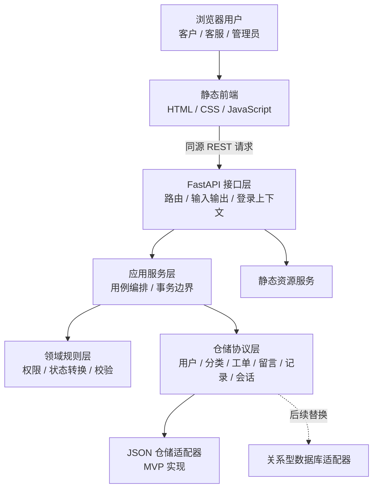
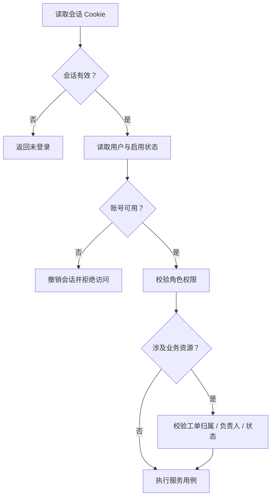
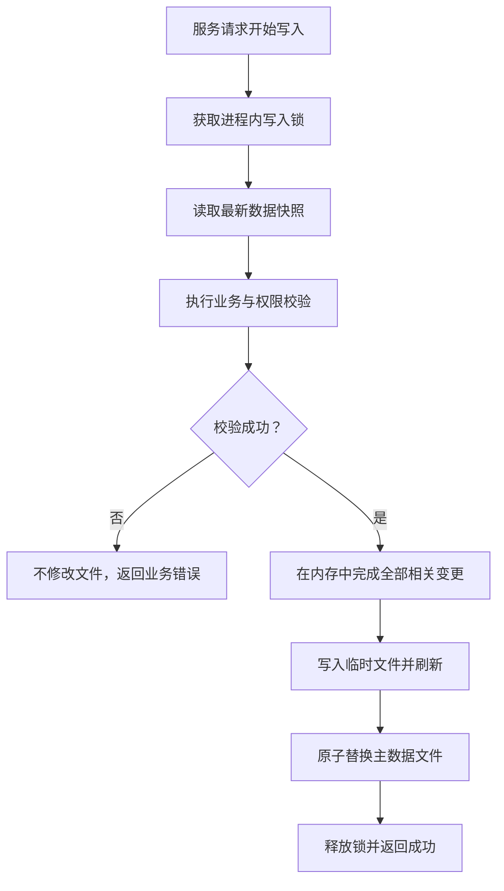

# 企业售后工单系统 技术设计说明书

| 项目 | 内容 |
| --- | --- |
| 文档版本 | v1.0（已确认版） |
| 适用版本 | 最小可行产品（MVP） |
| 文档性质 | 系统设计阶段技术方案 |
| 编制依据 | 《企业售后工单系统 产品需求文档（PRD）v1.0》、《企业售后工单系统 软件需求规格说明书（SRS）v1.0》、《企业售后工单系统 页面与交互说明 v1.0》 |
| 当前状态 | 已经用户确认，作为数据模型、接口定义、测试规划与实施计划编制的技术基线 |
| 编制日期 | 2026-05-26 |

## 1. 文档目的

本文档定义最小可行产品（MVP）的总体技术架构、前后端组织方式、后端模块边界、认证与授权机制、数据访问抽象、`JSON` 文件持久化策略、配置启动方式、异常处理、安全措施与测试策略。其目标是在满足已确认需求的前提下，形成可以继续展开数据模型设计和接口设计的技术基线。

本文档不完整定义业务实体字段表、`JSON` 最终数据结构、每个 REST 接口的请求响应格式或测试用例清单。这些内容分别在《数据模型设计》《API 接口设计》和《测试与验收方案》中细化。

## 2. 设计目标与约束

### 2.1 设计目标

| 编号 | 设计目标 | 说明 |
| --- | --- | --- |
| TD-G01 | 快速完成可运行的 MVP | 支持本地启动和浏览器演示完整工单流程。 |
| TD-G02 | 严格落实权限边界 | 任何敏感操作均由后端依据登录身份、角色和资源归属判断。 |
| TD-G03 | 保证基本数据持久化 | 服务重启后业务数据可继续读取，常规保存不产生损坏文件。 |
| TD-G04 | 保持存储可替换 | 业务服务不依赖 `JSON` 文件结构，后续可以实现关系型数据库仓储。 |
| TD-G05 | 保持结构可测试 | 业务规则、授权逻辑和仓储适配能够独立验证。 |

### 2.2 已确认约束

| 约束 | 技术影响 |
| --- | --- |
| 前端采用原生 `HTML`、`CSS`、`JavaScript` | 不引入前端框架或构建链作为 MVP 必要条件。 |
| 后端采用 Python `FastAPI` | 使用 Python 模块化服务和 REST 风格接口。 |
| MVP 使用 `JSON` 文件持久化 | 设计原子写入、并发保护与仓储边界。 |
| 后续需支持真实关系型数据库 | 服务层只能面向仓储协议，不直接处理文件。 |
| 本地演示及小规模试用 | 优先简洁稳定的单服务部署，不设计分布式能力。 |
| 密码安全哈希和后端鉴权 | 认证与授权作为基础架构能力提供。 |

### 2.3 非设计目标

- 不设计多租户、企业组织、知识库或多级处理团队架构。
- 不提供附件对象存储、消息渠道集成、统计分析或 SLA 引擎。
- 不针对多实例、高并发或互联网生产部署进行优化。
- 不在 MVP 中实现数据库迁移脚本、容灾备份或完整安全加固方案。

## 3. 总体架构

### 3.1 架构风格

MVP 采用单体 Web 应用架构。`FastAPI` 应用同时提供 REST 接口与前端静态资源，使浏览器页面和 API 处于同源环境，以简化认证 Cookie、安全策略和本地启动流程。前端通过原生 JavaScript 调用后端接口，后端按接口层、应用服务层、领域规则层、仓储抽象层和基础设施实现层组织。



### 3.2 部署单元

| 组成 | MVP 形态 | 说明 |
| --- | --- | --- |
| 浏览器前端 | 静态文件 | 由同一 `FastAPI` 服务提供访问。 |
| 后端 API | 单个 Python 应用进程 | 运行 REST 接口、静态资源和认证授权逻辑。 |
| 数据文件 | 本地单个主数据 `JSON` 文件 | 保存业务数据与会话数据，并通过原子写入保护。 |
| 配置 | 环境变量及本地配置默认值 | 保存启动参数，不保存用户明文密码。 |

### 3.3 运行边界

MVP 以**单进程、单服务实例**运行。`JSON` 写入并发保护在单个应用进程内实现，适合本地演示和小规模试用。MVP 不应使用多个应用工作进程同时写入同一数据文件；未来正式运行阶段切换至关系型数据库后，再支持更强的并发和部署模式。

## 4. 技术选型建议

| 技术领域 | 选择 | 选择理由 |
| --- | --- | --- |
| 后端语言 | Python | 用户指定，适合快速开发与测试。 |
| Web 框架 | `FastAPI` | 用户指定；适合 REST 接口、请求校验和自动接口文档。 |
| 数据校验 | Python 类型模型与框架校验能力 | 统一请求、响应和配置数据的约束表达。 |
| 前端 | 原生 `HTML`、`CSS`、`JavaScript` 模块 | 用户指定；无需复杂构建工具，适合 MVP 页面数量。 |
| 静态资源提供 | 由 `FastAPI` 托管静态资源 | 前端与 API 同源，减少跨域与认证配置复杂度。 |
| 密码保存 | `Argon2id` 安全密码哈希算法 | 避免明文或快速哈希，满足密码保存底线。 |
| 身份会话 | 服务端会话 + `HttpOnly` Cookie | 浏览器脚本不直接读取认证凭证，便于退出和禁用用户后失效。 |
| MVP 存储 | 单个版本化 `JSON` 主数据文件 | 便于原子写入并保证跨集合操作一致性。 |
| 自动化测试 | Python 测试工具 + FastAPI 测试客户端 | 覆盖服务和接口权限规则。 |

具体第三方包名称与版本将在项目初始化或实施计划中根据实际 Python 环境确定，本文仅确定技术能力和选型原则。

## 5. 建议项目结构

```text
enterpriseSpec/
  AGENTS.md
  docs/
  backend/
    app/
      main.py
      config.py
      dependencies.py
      api/
        auth.py
        users.py
        categories.py
        tickets.py
      schemas/
      services/
        auth_service.py
        user_service.py
        category_service.py
        ticket_service.py
      domain/
        models.py
        enums.py
        rules.py
        errors.py
      repositories/
        protocols.py
        json_repository.py
      security/
        password.py
        sessions.py
      storage/
        json_store.py
        bootstrap.py
    data/
      store.json
    tests/
  frontend/
    login.html
    register.html
    customer/
    internal/
    assets/
      css/
      js/
```

### 5.1 目录职责

| 目录/模块 | 职责 |
| --- | --- |
| `api/` | 声明路由、解析输入、获取当前身份、将结果转换为 HTTP 响应。 |
| `schemas/` | 定义 API 请求和响应使用的数据结构，不承担业务判断。 |
| `services/` | 编排注册、建单、分配、留言、状态推进等业务用例。 |
| `domain/` | 定义业务枚举、状态转换、角色规则和领域错误。 |
| `repositories/` | 声明仓储协议并实现 `JSON` 仓储适配器。 |
| `security/` | 密码哈希、会话创建验证和认证相关工具。 |
| `storage/` | `JSON` 读写、文件初始化、写入锁与管理员引导初始化。 |
| `frontend/` | 静态页面和共享脚本，以 API 获取及提交业务数据。 |
| `tests/` | 单元测试、服务测试、接口权限与持久化测试。 |

目录名称属于设计建议，可在实现前根据 Python 包组织需要作轻微调整，但模块责任边界应保持一致。

## 6. 前端设计

### 6.1 前端组织方式

前端采用多页面静态应用方式，每个主要页面对应独立 HTML 页面，通过共享样式与 JavaScript 模块复用通用能力。该方式适合 MVP 的有限页面规模，也能保持导航与权限显示逻辑直观。

| 前端模块 | 职责 |
| --- | --- |
| `api-client.js` | 封装 `fetch` 请求、统一 JSON 响应处理和未登录跳转。 |
| `session-ui.js` | 读取当前用户基本身份、显示页头和按角色构建导航。 |
| `form-utils.js` | 必填、长度校验和表单错误提示的通用处理。 |
| `ticket-ui.js` | 状态文字、列表展示、留言渲染和工单操作辅助。 |
| 页面脚本 | 加载当前页面数据，绑定该页面允许的业务操作。 |

### 6.2 页面与目录映射

| 页面范围 | 建议资源位置 | 访问角色 |
| --- | --- | --- |
| 登录、注册 | `frontend/login.html`、`frontend/register.html` | 未登录用户 |
| 我的工单、新建工单、客户详情 | `frontend/customer/` | 客户 |
| 内部工单列表、内部详情 | `frontend/internal/` | 客服、管理员 |
| 分类、客服账号、客户账号管理 | `frontend/internal/` 管理页面 | 管理员 |

### 6.3 前端安全和权限原则

- 页面脚本可以根据身份隐藏无权操作的导航与按钮，以符合交互要求。
- 页面初始化时必须通过后端取得当前身份或由受保护接口确认权限，不能将浏览器存储中的角色字段作为授权依据。
- 工单标题、描述、留言等用户输入文本通过文本节点或等效安全方式展示，不作为 HTML 执行。
- 认证信息不保存在浏览器本地存储或脚本可读取的 Cookie 中。

## 7. 后端分层设计

### 7.1 接口层

接口层负责 HTTP 边界，不承载核心业务规则：

- 接收请求、进行结构和类型校验。
- 获取当前登录用户并注入应用服务。
- 将领域错误映射为统一 HTTP 错误响应。
- 将服务返回的数据映射为响应模型。
- 提供静态资源和前端入口访问。

### 7.2 应用服务层

应用服务层以用例为单位组织流程：

| 服务 | 主要用例 |
| --- | --- |
| 认证服务 | 客户注册、登录、退出、当前身份、管理员初始化。 |
| 用户管理服务 | 管理员创建客服、查询客户、启用/禁用客户。 |
| 分类服务 | 新增、编辑、启用/停用、获取有效分类。 |
| 工单服务 | 客户建单、列表和详情查询、管理员分配、留言、状态推进。 |
| 记录查询能力 | 在内部详情中读取相关操作记录。 |

每个写入用例应在一次仓储写入事务中保存业务变更及其操作记录。例如工单重新分配必须同时保存负责人变化和对应记录，不能出现一个成功而另一个未保存的情况。

### 7.3 领域规则层

领域规则层应提供不依赖 Web 或存储实现的判断逻辑：

- 角色与资源权限判断。
- 工单状态枚举和线性转换验证。
- 工单是否允许留言、分配或关闭。
- 文本输入规范化和业务字段限制。
- 分类启停、客户启停产生的业务约束。

这些规则应优先通过纯函数或小型领域对象实现，以便独立测试。

### 7.4 仓储协议层

仓储层向服务层暴露业务数据读写能力，而非文件操作细节。建议提供下列逻辑协议：

| 仓储能力 | 示例职责 |
| --- | --- |
| 用户仓储 | 按标识查询用户、保存客户/客服、更新客户状态、识别管理员存在。 |
| 分类仓储 | 保存分类、查询有效分类、更新分类状态。 |
| 工单仓储 | 创建工单、查询工单、列出工单、更新负责人和状态。 |
| 留言仓储 | 创建留言、按工单读取留言。 |
| 操作记录仓储 | 追加记录、按工单或管理操作读取记录。 |
| 会话仓储 | 创建、读取、撤销和清理登录会话。 |

MVP 中可由一个 `JsonRepository` 实现多个仓储协议，并以一次存储提交支持跨实体变更；后续数据库版本可以拆分为数据库仓储实现。

## 8. 身份认证与授权设计

### 8.1 密码保存

| 项目 | 设计 |
| --- | --- |
| 保存方式 | 采用 `Argon2id` 密码哈希，存储算法参数与哈希结果，不保存明文密码。 |
| 注册/创建客服 | 输入密码只用于计算哈希，处理完成后不写入日志或响应。 |
| 登录验证 | 对输入密码与存储哈希进行验证；失败时返回统一登录失败信息。 |
| 管理员初始化 | 初始密码同样只保存安全哈希。 |

### 8.2 会话方案

MVP 使用服务端会话，而不将角色权限直接放入浏览器可用令牌：

| 项目 | 设计 |
| --- | --- |
| 会话凭证 | 登录成功后生成高熵随机会话标识。 |
| 浏览器保存 | 使用 `HttpOnly`、`SameSite=Lax` Cookie；本地 HTTP 演示时可配置 `Secure`，在 HTTPS 部署时必须启用。 |
| 服务端保存 | 保存会话标识的哈希值、关联用户、创建时间、最后使用时间与过期时间。 |
| 请求认证 | 每个受保护请求依据 Cookie 查找有效会话，并重新读取用户启用状态和角色。 |
| 退出 | 删除或撤销当前会话，并清除浏览器 Cookie。 |
| 客户禁用 | 因每次请求重新校验账号状态，已登录但随后被禁用的客户在下一次受保护请求时被拒绝。 |

### 8.3 会话期限

MVP 采用固定 8 小时有效期会话，不实现续期或“记住我”。过期会话视为未登录并可在后续清理中移除。

### 8.4 授权检查顺序

每项受保护操作应按以下顺序处理：



| 检查类型 | 示例 |
| --- | --- |
| 登录检查 | 未登录用户不得访问工单数据。 |
| 角色检查 | 客户不能调用内部管理能力；客服不能维护分类。 |
| 资源归属检查 | 客户只能访问自己创建的工单。 |
| 处理权限检查 | 客服只能留言或推进自己负责的工单。 |
| 状态检查 | 已关闭工单禁止留言、重分配和推进。 |

## 9. JSON 持久化设计

### 9.1 存储策略

MVP 使用一个版本化的主数据文件，例如 `backend/data/store.json`，统一保存业务集合和会话集合。这样，在建单并追加创建记录、分配并追加操作记录、状态更新并追加记录等操作中，能够以一次原子写入提交全部变更。

主数据文件逻辑结构将在《数据模型设计》中细化，技术上应包含：

- `schema_version`：支持未来识别数据结构版本。
- `users`、`categories`、`tickets`、`messages`、`audit_logs`、`sessions` 等集合。
- 稳定的唯一标识符及实体关联标识。

### 9.2 读写机制

| 能力 | 设计要求 |
| --- | --- |
| 初始化 | 文件不存在时创建具有当前模式版本和空集合的存储文件。 |
| 读取 | 读取后进行基础结构校验；文件损坏时停止写入并报告启动或操作错误。 |
| 写入锁 | 对写入操作使用应用进程级异步锁，防止同进程请求互相覆盖。 |
| 原子保存 | 将完整新数据写入同目录临时文件，刷新成功后以原子替换方式替换主文件。 |
| 事务单元 | 单个应用服务写操作在锁内完成读取最新快照、校验、变更和原子保存。 |
| 备份 | MVP 不要求自动备份；开发期间可人工保留演示数据文件副本。 |

### 9.3 写入处理流程



### 9.4 存储限制

- 应用必须以单进程运行，不允许多个服务实例并发写入同一 `JSON` 文件。
- 业务列表规模按 MVP 目标设计，不提供分页、索引或高性能查询优化。
- 若后续开始正式日常运行，应优先执行迭代 3 的关系型数据库迁移，而不是继续扩展文件存储能力。

## 10. 管理员初始化与配置设计

### 10.1 首个管理员初始化

MVP 采用启动配置初始化首个管理员：

1. 系统启动时读取管理员初始化环境变量，例如用户名、电子邮箱和初始密码。
2. 当数据存储中不存在管理员时，系统验证配置并创建首个管理员账号。
3. 当管理员已经存在时，启动配置不得覆盖或新增管理员。
4. 初始密码只用于生成哈希，不写入数据文件明文字段或日志。
5. 若系统首次启动但未提供有效管理员初始化配置，服务可启动公共页面，但内部管理能力无法使用，并在启动日志明确提示需要配置管理员。

该方案避免在公开网页中提供管理员创建入口，也便于本地演示初始化。

### 10.2 配置项类别

| 配置类别 | 内容示例 | 原则 |
| --- | --- | --- |
| 应用配置 | 应用名称、运行模式、日志级别 | 提供合理本地默认值。 |
| 数据配置 | `JSON` 数据文件路径 | 默认指向项目本地数据目录，可由环境变量覆盖。 |
| 会话配置 | Cookie 名称、有效期、是否启用 `Secure` | 开发与后续 HTTPS 环境可分别配置。 |
| 初始化配置 | 初始管理员用户名、邮箱、密码 | 仅首次初始化使用；不得写入版本库。 |

## 11. API 设计边界

本文只定义接口模块和通用约束，具体 URL、请求模型、响应字段和错误码由《API 接口设计》确认。

### 11.1 接口模块

| 模块 | 主要接口能力 | 调用角色 |
| --- | --- | --- |
| 认证 | 注册、登录、退出、获取当前身份 | 公开/已登录用户 |
| 分类 | 获取有效分类；管理分类 | 客户/管理员 |
| 用户管理 | 创建客服；查看与启停客户 | 管理员 |
| 客户工单 | 创建工单、列出本人工单、读取本人详情 | 客户 |
| 内部工单 | 列出和按状态筛选全部工单、读取详情 | 客服、管理员 |
| 工单处理 | 分配、留言、推进状态 | 按负责人及管理员权限 |
| 操作记录 | 获取工单操作记录 | 客服、管理员 |

### 11.2 通用接口约束

| 主题 | 设计约束 |
| --- | --- |
| 数据格式 | API 请求和响应使用 `JSON`，静态页面访问除外。 |
| 认证方式 | 依赖会话 Cookie，由后端统一解析。 |
| 错误响应 | 使用一致结构表达错误类别、用户可读信息和可选字段错误。 |
| 时间表示 | 后端以统一时间格式返回，前端以中文易读格式展示。 |
| 权限失败 | 不泄露其他客户工单数据或账号存在信息。 |
| 重复提交 | 前端在提交期间禁用按钮；后端仍负责业务有效性校验。 |

## 12. 异常处理与日志设计

### 12.1 错误分类

| 错误类型 | 示例 | 处理方式 |
| --- | --- | --- |
| 输入校验错误 | 标题过长、邮箱格式错误 | 返回字段级错误，前端展示在相关表单。 |
| 身份认证错误 | 未登录、会话过期、登录失败 | 返回统一认证提示或引导登录。 |
| 权限错误 | 客户访问他人工单、客服修改非负责工单 | 拒绝请求，不返回敏感数据。 |
| 业务状态冲突 | 分类已停用、工单已关闭、状态已改变 | 返回当前不可执行原因，提示刷新数据。 |
| 存储错误 | 数据文件损坏或原子写入失败 | 操作失败，不返回成功；记录服务端错误便于排查。 |

### 12.2 应用日志

| 日志内容 | 是否记录 | 注意事项 |
| --- | --- | --- |
| 服务启动及存储初始化结果 | 是 | 可记录数据路径和初始化状态。 |
| 管理员初始化是否成功 | 是 | 不记录初始密码。 |
| 未处理异常和持久化失败 | 是 | 便于开发调试。 |
| 密码、会话 Cookie、会话原始标识 | 否 | 不得写入日志。 |
| 业务操作审计 | 保存为操作记录 | 由业务数据提供查询，不依赖文本日志。 |

## 13. 安全设计

| 风险 | MVP 防护设计 |
| --- | --- |
| 密码泄露 | 使用 `Argon2id` 哈希，不记录明文密码。 |
| 会话凭证被脚本读取 | 使用 `HttpOnly` Cookie；前端不持有认证令牌。 |
| 跨站请求风险 | Cookie 使用 `SameSite=Lax`；同源前端减少跨域配置。正式互联网部署前需进一步评估防跨站请求伪造措施。 |
| 越权访问 | 每个受保护接口执行角色和资源级授权校验。 |
| 客户内容注入脚本 | 前端使用安全文本渲染，不直接注入用户 HTML。 |
| 数据文件暴露 | 数据文件位于静态资源目录之外，不提供浏览器直接访问。 |
| 管理员入口滥用 | 首个管理员通过启动配置初始化，不提供公开管理员注册页面。 |

## 14. 测试设计策略

### 14.1 测试层级

| 测试层级 | 目标 | 覆盖示例 |
| --- | --- | --- |
| 领域规则单元测试 | 验证不依赖存储或 HTTP 的业务判断 | 状态转换、角色处理权限、输入限制。 |
| 服务层测试 | 验证用例编排与操作记录一致性 | 建单、分配、禁用客户、关闭限制。 |
| 仓储测试 | 验证 JSON 存储正确性与可恢复性 | 初始化、原子写入后读取、重启模拟、标识关联。 |
| API 集成测试 | 验证认证、响应与越权拒绝 | 注册登录、不同角色调用接口、他人工单拒绝。 |
| 页面流程验证 | 验证浏览器端关键路径 | 客户提交、管理员分配、客服处理、客户查看。 |

### 14.2 关键测试隔离方式

- 测试使用临时数据文件，不读写演示数据文件。
- 测试可通过替代仓储或临时 JSON 仓储验证服务规则。
- 认证测试应验证 Cookie 登录、退出撤销、禁用客户后会话不可继续使用。
- 存储测试应验证写入失败或非法操作不会留下已宣称成功的部分更新。

## 15. 后续数据库演进设计

MVP 不实现关系型数据库，但必须形成清晰替换路径：

| 当前设计 | 后续演进方式 |
| --- | --- |
| 仓储协议 | 新增数据库仓储适配器，实现同样的业务读写接口。 |
| 稳定标识符 | 作为数据库主键或外部标识继续保留。 |
| 操作记录 | 迁移为独立审计/事件记录表。 |
| 应用服务 | 保持用例与规则不变，仅替换仓储依赖注入。 |
| JSON `schema_version` | 用于识别迁移源数据版本并编写迁移导入工具。 |
| 单文件事务 | 替换为数据库事务，保证跨表写入一致性。 |

进入正式运行基础迭代时，应单独设计数据库结构、数据迁移验证、备份恢复与部署安全能力。

## 16. 技术设计与需求追踪

| 需求范围 | 技术设计响应 |
| --- | --- |
| 三类角色登录与权限隔离 | 服务端会话、后端依赖注入身份、服务与领域授权规则。 |
| 密码不得明文保存 | `Argon2id` 密码哈希模块。 |
| 客户禁用后会话失效 | 每次受保护请求读取用户状态并撤销不可用会话。 |
| 分类维护与停用历史保留 | 分类服务与仓储引用保留，不实施物理删除。 |
| 建单、分配、留言与状态闭环 | 工单应用服务与状态规则模块。 |
| 关键过程可追溯 | 写操作与操作记录在同一存储提交中保存。 |
| 服务重启后数据保存 | 本地版本化 JSON 数据文件。 |
| 后续替换数据库 | 仓储协议与依赖注入边界。 |
| 页面角色导航与同源访问 | FastAPI 静态服务 + 原生多页面前端。 |
| 前端不可替代权限检查 | 所有写入和受保护读取由后端验证。 |

## 17. 已确认的技术决策

以下内容将已确认需求落实为具体实现方向，未扩大 MVP 业务功能范围；这些技术决策已经用户确认，将作为数据模型、接口设计与实施计划的技术依据：

| 编号 | 已确认技术决策 | 方案 |
| --- | --- | --- |
| TD-C01 | 应用部署结构 | 采用单体 Web 应用，`FastAPI` 同时托管 REST API 和静态前端页面，保持同源。 |
| TD-C02 | 前端组织方式 | 使用原生 JavaScript 的多页面静态应用与共享脚本模块，不引入构建框架。 |
| TD-C03 | 密码哈希方案 | 使用 `Argon2id` 保存用户密码哈希。 |
| TD-C04 | 登录状态方案 | 使用服务端会话，浏览器仅保存 `HttpOnly`、`SameSite=Lax` 的会话 Cookie。 |
| TD-C05 | 会话有效期 | MVP 采用固定 8 小时会话，不实现续期或“记住我”。 |
| TD-C06 | JSON 文件结构策略 | 使用单个版本化主数据文件统一保存实体和会话，以一次原子替换完成跨实体写入。 |
| TD-C07 | JSON 并发边界 | 采用进程内写入锁与临时文件原子替换，MVP 仅支持单应用进程写入。 |
| TD-C08 | 管理员初始化 | 首个管理员由环境变量形式的启动配置初始化；已有管理员后不再次创建或覆盖。 |
| TD-C09 | 项目分层 | 使用接口层、应用服务层、领域规则层、仓储协议层和基础设施实现层的模块边界。 |
| TD-C10 | 接口响应形式 | 业务 API 使用 JSON 请求/响应和统一错误结构，具体路径与数据结构由接口设计文档确定。 |

## 18. 后续设计文档衔接

本技术设计经确认后，后续系统设计文档应按以下职责继续细化：

| 文档 | 基于本设计需确定的内容 |
| --- | --- |
| 数据模型设计 | 业务实体、会话、审计记录的字段与关系；`JSON` 文件模式；未来数据库映射。 |
| API 接口设计 | 路径、请求响应结构、Cookie 认证、权限、状态码与错误模型。 |
| 测试与验收方案 | 技术边界对应的可执行测试、权限测试、持久化测试和页面业务验证。 |
| MVP 实施计划 | 模块实现顺序、任务拆解、依赖安装、验证里程碑和交付步骤。 |

## 19. 确认记录

| 日期 | 确认人 | 结果 | 备注 |
| --- | --- | --- | --- |
| 2026-05-26 | 用户 | 已确认 | 本文档及第 17 章技术决策可作为后续数据模型、接口定义、测试规划和实施计划的正式技术基线。 |
