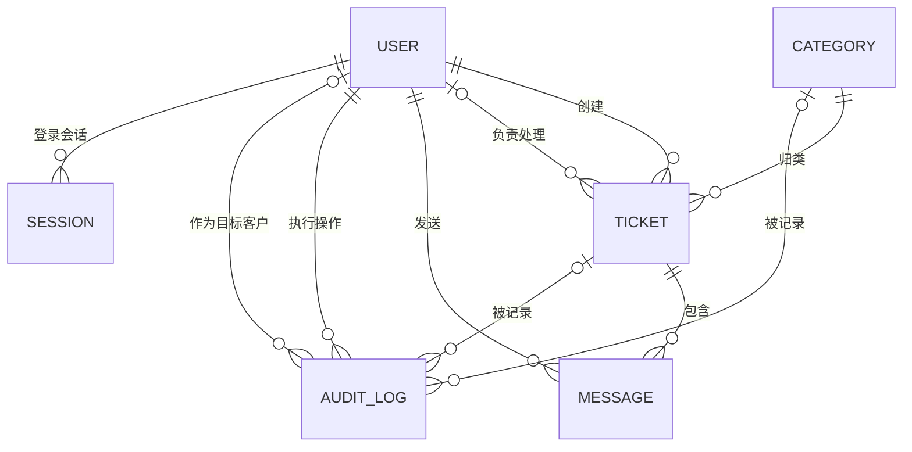

# 企业售后工单系统 数据模型设计

| 项目 | 内容 |
| --- | --- |
| 文档版本 | v1.0（已确认版） |
| 适用版本 | 最小可行产品（MVP） |
| 文档性质 | 系统设计阶段数据模型方案 |
| 编制依据 | 《企业售后工单系统 软件需求规格说明书（SRS）v1.0》、《企业售后工单系统 页面与交互说明 v1.0》、《企业售后工单系统 技术设计说明书 v1.0》 |
| 当前状态 | 已经用户确认，作为接口定义、存储实现、测试规划与实施计划编制的数据基线 |
| 编制日期 | 2026-05-26 |

## 1. 文档目的

本文档定义最小可行产品（MVP）的数据模型，包括用户、问题分类、工单、公开留言、操作记录与登录会话等实体的字段、关联关系、枚举规则、完整性约束、版本化 `JSON` 文件模式以及未来映射至关系型数据库的方式。

本文档在已确认业务规则和技术架构之上补充数据层细节。文档确认后，应作为《API 接口设计》、持久化实现、仓储协议实现、测试与验收方案及 MVP 实施计划的数据依据。

## 2. 建模原则

| 编号 | 原则 | 说明 |
| --- | --- | --- |
| DM-P01 | 业务实体清晰分离 | 用户、分类、工单、留言、操作记录、会话使用独立集合，避免嵌套写入导致迁移困难。 |
| DM-P02 | 标识符稳定 | 实体使用与存储介质无关的唯一标识，以支持后续数据库迁移。 |
| DM-P03 | 关键历史可追溯 | 状态、负责人、分类和账号启停变化通过操作记录保留。 |
| DM-P04 | 存储实现可替换 | `JSON` 文件结构服务于 MVP 持久化，但模型可直接映射到关系型数据库。 |
| DM-P05 | 最小数据收集 | 只保存 MVP 业务、认证和审计所需的数据，不预设附件、统计或企业组织字段。 |
| DM-P06 | 凭证最小暴露 | 只保存密码哈希和会话标识哈希，不保存明文密码或原始会话凭证。 |

## 3. 通用数据规范

### 3.1 标识符

| 项目 | 设计规则 |
| --- | --- |
| 适用实体 | 用户、分类、工单、留言、操作记录、会话 |
| 数据类型 | 字符串 |
| 生成方式 | 应用端生成 UUID v4 标准字符串，例如 `550e8400-e29b-41d4-a716-446655440000`。 |
| 可变性 | 创建后不得更改，不向用户提供编辑能力。 |
| 设计理由 | 避免依赖文件数组位置，便于后续映射为数据库主键或业务外部标识。 |

### 3.2 时间字段

| 项目 | 设计规则 |
| --- | --- |
| 数据类型 | 字符串 |
| 存储时区 | 统一使用 UTC。 |
| 存储格式 | ISO 8601 格式并带 `Z` 后缀，例如 `2026-05-26T10:20:30Z`。 |
| 页面展示 | 前端根据展示需要转换为本地易读时间。 |
| 适用字段 | `created_at`、`updated_at`、`sent_at`、`occurred_at`、`expires_at`、`revoked_at`。 |

### 3.3 文本规范化

| 字段类型 | 保存前处理 | 唯一性/比较规则 |
| --- | --- | --- |
| 用户名 | 去除首尾空白，保留原始大小写。 | 按保存值精确比较；用户名唯一。 |
| 电子邮箱 | 去除首尾空白并转为小写保存。 | 不区分大小写；邮箱唯一。 |
| 分类名称 | 去除首尾空白。 | 名称唯一；MVP 按保存值比较。 |
| 标题、描述、留言 | 去除首尾空白后保存，保留正文内容。 | 不参与唯一性判断。 |

### 3.4 空值与删除策略

| 主题 | 设计规则 |
| --- | --- |
| 可空字段 | 以 JSON `null` 表示，例如尚未分配负责人的 `assignee_user_id`。 |
| 实体删除 | MVP 不提供用户、分类、工单、留言或操作记录的物理删除。 |
| 分类停用 | 通过 `status` 切换为 `inactive`；历史工单引用保留。 |
| 客户禁用 | 通过 `status` 切换为 `disabled`；历史工单、留言与审计信息保留。 |
| 会话清理 | 已退出或过期的会话可以从存储中清理，不影响业务审计数据。 |

## 4. 枚举定义

### 4.1 用户角色 `UserRole`

| 存储值 | 中文展示 | 说明 |
| --- | --- | --- |
| `customer` | 客户 | 外部个人客户，通过开放注册创建。 |
| `agent` | 客服 | 内部处理人员，由管理员创建。 |
| `admin` | 管理员 | 内部管理人员，由首次初始化机制创建。 |

### 4.2 用户状态 `UserStatus`

| 存储值 | 中文展示 | 适用范围 | 说明 |
| --- | --- | --- | --- |
| `active` | 启用 | 全部用户 | 可以依据角色正常登录和操作。 |
| `disabled` | 禁用 | 客户 | 管理员禁用客户后使用；客户不能登录或继续受保护操作。 |

MVP 页面只提供客户状态管理。管理员与客服记录保留 `active` 状态字段以保持模型一致，但 MVP 不提供禁用内部账号的业务操作。

### 4.3 分类状态 `CategoryStatus`

| 存储值 | 中文展示 | 说明 |
| --- | --- | --- |
| `active` | 启用 | 可以被客户选择创建新工单。 |
| `inactive` | 停用 | 不得用于新工单，历史引用继续展示。 |

### 4.4 工单状态 `TicketStatus`

| 存储值 | 中文展示 | 允许下一状态 |
| --- | --- | --- |
| `unassigned` | 待分配 | `processing` |
| `processing` | 处理中 | `resolved` |
| `resolved` | 已解决 | `closed` |
| `closed` | 已关闭 | 无 |

### 4.5 操作记录类型 `AuditAction`

| 存储值 | 中文含义 | 关联对象 |
| --- | --- | --- |
| `ticket_created` | 创建工单 | 工单 |
| `ticket_assigned` | 首次分配工单 | 工单 |
| `ticket_reassigned` | 重新分配工单 | 工单 |
| `ticket_status_changed` | 工单状态变化 | 工单 |
| `category_created` | 创建问题分类 | 分类 |
| `category_updated` | 编辑分类名称 | 分类 |
| `category_status_changed` | 分类启用/停用 | 分类 |
| `customer_status_changed` | 客户启用/禁用 | 用户 |

公开留言自身已经记录发送人、内容与时间，MVP 不再为每条留言额外创建重复操作记录。

## 5. 实体关系概览



### 5.1 关系说明

| 关系 | 基数 | 约束说明 |
| --- | --- | --- |
| 客户创建工单 | 一个客户对零到多个工单 | `tickets.customer_user_id` 必须引用角色为 `customer` 的用户。 |
| 分类归属工单 | 一个分类对零到多个工单 | 工单创建时分类必须为启用状态；之后分类停用不破坏关联。 |
| 客服负责工单 | 一个客服对零到多个工单 | 未分配工单负责人为空；非空时必须引用角色为 `agent` 的用户。 |
| 工单包含留言 | 一个工单对零到多个留言 | 已关闭工单不能新增留言。 |
| 用户发送留言 | 一个用户对零到多个留言 | 发送权限由角色、归属、负责人和工单状态校验。 |
| 用户产生会话 | 一个用户对零到多个会话 | 有效会话仍需在请求时核验用户状态。 |
| 操作记录 | 操作者对多个记录 | 记录目标类型和目标标识；工单记录可在详情页查询。 |

## 6. 用户实体 `User`

### 6.1 用途

保存客户、客服和管理员统一账号信息。角色决定功能范围，状态决定账号当前是否可使用。

### 6.2 字段定义

| 字段名 | 类型 | 必填 | 约束与说明 |
| --- | --- | --- | --- |
| `id` | string | 是 | UUID v4；用户唯一标识。 |
| `username` | string | 是 | 去除首尾空白后 3 至 50 个字符；允许中文、英文字母、数字、下划线和连字符；全局唯一。 |
| `email` | string | 是 | 小写规范化邮箱；长度不超过 254；全局唯一。 |
| `password_hash` | string | 是 | `Argon2id` 编码后的密码哈希字符串；不得返回至前端。 |
| `role` | enum | 是 | `customer`、`agent` 或 `admin`。 |
| `status` | enum | 是 | `active` 或 `disabled`；新建时为 `active`。 |
| `created_at` | datetime string | 是 | 创建时间。 |
| `updated_at` | datetime string | 是 | 状态变化等账号更新时更新。 |

### 6.3 字段可修改性

| 字段 | 客户可修改 | 客服可修改 | 管理员可修改 | MVP 规则 |
| --- | --- | --- | --- | --- |
| `username` | 否 | 否 | 否 | 创建后不提供修改。 |
| `email` | 否 | 否 | 否 | 创建后不提供修改。 |
| `password_hash` | 否 | 否 | 否 | MVP 不提供密码修改或重置。 |
| `role` | 否 | 否 | 否 | 创建后不得改变角色。 |
| `status` | 否 | 否 | 仅客户账号 | 管理员可启用或禁用客户。 |

### 6.4 完整性规则

| 编号 | 规则 |
| --- | --- |
| DM-USR-001 | 客户注册创建的用户必须为 `role=customer` 且 `status=active`。 |
| DM-USR-002 | 管理员创建客服时必须为 `role=agent` 且 `status=active`。 |
| DM-USR-003 | 管理员初始化创建用户必须为 `role=admin` 且 `status=active`。 |
| DM-USR-004 | `username` 与 `email` 分别全局唯一，避免不同角色共享登录标识。 |
| DM-USR-005 | `password_hash` 仅由认证模块写入或读取，接口响应不得包含该字段。 |
| DM-USR-006 | MVP 中 `disabled` 仅能由管理员应用于客户用户。 |

## 7. 问题分类实体 `Category`

### 7.1 用途

保存管理员维护的一级问题分类，供客户新建工单时选择，并为历史工单提供分类引用。

### 7.2 字段定义

| 字段名 | 类型 | 必填 | 约束与说明 |
| --- | --- | --- | --- |
| `id` | string | 是 | UUID v4；分类唯一标识。 |
| `name` | string | 是 | 去除首尾空白后 1 至 50 个字符；全局唯一。 |
| `status` | enum | 是 | `active` 或 `inactive`；创建时为 `active`。 |
| `created_by_user_id` | string | 是 | 引用创建该分类的管理员用户。 |
| `created_at` | datetime string | 是 | 创建时间。 |
| `updated_at` | datetime string | 是 | 名称或状态变化时更新。 |

### 7.3 完整性规则

| 编号 | 规则 |
| --- | --- |
| DM-CAT-001 | 分类只可由管理员创建、编辑名称或切换状态。 |
| DM-CAT-002 | 客户新建工单时只能引用 `status=active` 的分类。 |
| DM-CAT-003 | 分类不得物理删除；停用后已有工单引用继续有效。 |
| DM-CAT-004 | `created_by_user_id` 必须指向角色为 `admin` 的用户。 |

## 8. 工单实体 `Ticket`

### 8.1 用途

保存客户提交的问题主体、当前分类、当前处理状态与负责人信息，是业务流程核心实体。

### 8.2 字段定义

| 字段名 | 类型 | 必填 | 约束与说明 |
| --- | --- | --- | --- |
| `id` | string | 是 | UUID v4；工单唯一标识。 |
| `title` | string | 是 | 去除首尾空白后 1 至 100 个字符。 |
| `description` | string | 是 | 去除首尾空白后 1 至 4000 个字符。 |
| `category_id` | string | 是 | 引用创建时有效的问题分类。 |
| `category_name_snapshot` | string | 是 | 工单创建时分类名称快照，用于历史展示保持提交时含义。 |
| `customer_user_id` | string | 是 | 引用创建工单的客户用户。 |
| `status` | enum | 是 | `unassigned`、`processing`、`resolved` 或 `closed`；创建时为 `unassigned`。 |
| `assignee_user_id` | string/null | 是 | 当前负责客服用户标识；创建时为 `null`。 |
| `created_at` | datetime string | 是 | 创建时间。 |
| `updated_at` | datetime string | 是 | 分配、状态变化或新增留言时更新。 |

### 8.3 分类快照策略

工单同时保存 `category_id` 与 `category_name_snapshot`：

- `category_id` 保留与分类实体的关联，便于后续统计或数据库迁移。
- `category_name_snapshot` 固定保存客户提交时看到的分类名称。
- 管理员后续编辑分类名称或停用分类时，既有工单仍可展示其提交时的分类名称，不产生历史语义变化。

### 8.4 完整性规则

| 编号 | 规则 |
| --- | --- |
| DM-TKT-001 | `customer_user_id` 必须引用 `role=customer` 的用户。 |
| DM-TKT-002 | 新建时 `category_id` 必须引用 `status=active` 的分类，并保存当时名称快照。 |
| DM-TKT-003 | 新建时 `status=unassigned` 且 `assignee_user_id=null`。 |
| DM-TKT-004 | 非空 `assignee_user_id` 必须引用 `role=agent` 的用户。 |
| DM-TKT-005 | 工单基础字段 `title`、`description`、`category_id` 与 `category_name_snapshot` 创建后不修改。 |
| DM-TKT-006 | 状态仅按 `unassigned -> processing -> resolved -> closed` 变更。 |
| DM-TKT-007 | `closed` 工单不得变更负责人、状态或新增留言。 |
| DM-TKT-008 | 新增留言时更新 `updated_at`，但不修改状态。 |

## 9. 公开留言实体 `Message`

### 9.1 用途

保存客户与具有处理权限的内部用户围绕工单产生的公开沟通内容。

### 9.2 字段定义

| 字段名 | 类型 | 必填 | 约束与说明 |
| --- | --- | --- | --- |
| `id` | string | 是 | UUID v4；留言唯一标识。 |
| `ticket_id` | string | 是 | 引用所属工单。 |
| `sender_user_id` | string | 是 | 引用发送留言的用户。 |
| `sender_role_snapshot` | enum | 是 | 发送时角色快照：`customer`、`agent` 或 `admin`。 |
| `sender_name_snapshot` | string | 是 | 发送时用户名快照，用于稳定展示历史对话。 |
| `content` | string | 是 | 去除首尾空白后 1 至 2000 个字符。 |
| `sent_at` | datetime string | 是 | 发送时间。 |

### 9.3 完整性规则

| 编号 | 规则 |
| --- | --- |
| DM-MSG-001 | `ticket_id` 必须指向存在且未关闭的工单，保存后即使工单关闭仍可读取。 |
| DM-MSG-002 | 客户发送留言时，必须为该工单的创建客户且账号启用。 |
| DM-MSG-003 | 客服发送留言时，必须为该工单当前负责人。 |
| DM-MSG-004 | 管理员可向任一未关闭工单发送留言。 |
| DM-MSG-005 | 留言创建成功后不得编辑或删除。 |
| DM-MSG-006 | 保存留言与更新工单 `updated_at` 应在同一写入提交中完成。 |

## 10. 操作记录实体 `AuditLog`

### 10.1 用途

保存关键业务和管理动作的可追溯记录。操作记录为只追加数据，不提供编辑或删除能力。

### 10.2 字段定义

| 字段名 | 类型 | 必填 | 约束与说明 |
| --- | --- | --- | --- |
| `id` | string | 是 | UUID v4；记录唯一标识。 |
| `action` | enum | 是 | 取值见 `AuditAction`。 |
| `actor_user_id` | string | 是 | 执行动作的当前用户；工单创建为客户，其余管理/处理操作为内部用户。 |
| `actor_role_snapshot` | enum | 是 | 动作发生时操作者角色快照。 |
| `target_type` | enum | 是 | `ticket`、`category` 或 `user`。 |
| `target_id` | string | 是 | 被操作实体标识。 |
| `ticket_id` | string/null | 是 | 工单相关动作等于目标工单标识；非工单动作为 `null`。 |
| `changes` | object | 是 | 描述本次关键变更的结构化前后值；无前值时可为 `null`。 |
| `occurred_at` | datetime string | 是 | 操作发生时间。 |

### 10.3 `changes` 结构示例

| 操作类型 | `changes` 内容示例 |
| --- | --- |
| 创建工单 | `{ "status": { "before": null, "after": "unassigned" } }` |
| 首次分配 | `{ "assignee_user_id": { "before": null, "after": "客服标识" } }` |
| 重新分配 | `{ "assignee_user_id": { "before": "原客服标识", "after": "新客服标识" } }` |
| 状态变化 | `{ "status": { "before": "processing", "after": "resolved" } }` |
| 分类编辑 | `{ "name": { "before": "原名称", "after": "新名称" } }` |
| 分类状态变化 | `{ "status": { "before": "active", "after": "inactive" } }` |
| 客户状态变化 | `{ "status": { "before": "active", "after": "disabled" } }` |

### 10.4 完整性规则

| 编号 | 规则 |
| --- | --- |
| DM-AUD-001 | 创建工单、工单分配/重新分配、工单状态变化、分类创建/编辑/启停、客户启停必须追加操作记录。 |
| DM-AUD-002 | `actor_user_id` 必须引用操作发生时存在的用户；该用户后续状态变化不影响历史记录。 |
| DM-AUD-003 | 工单详情页查询操作记录时，通过 `ticket_id` 获取工单操作记录。 |
| DM-AUD-004 | 公开留言不创建额外操作记录，以 `Message` 实体本身承担沟通追溯。 |
| DM-AUD-005 | 业务变更与对应操作记录必须在同一 JSON 原子写入中保存。 |

## 11. 登录会话实体 `Session`

### 11.1 用途

保存服务端登录会话状态，配合浏览器 `HttpOnly` Cookie 实现认证。会话属于技术认证数据，不属于业务审计记录。

### 11.2 字段定义

| 字段名 | 类型 | 必填 | 约束与说明 |
| --- | --- | --- | --- |
| `id` | string | 是 | UUID v4；服务端会话记录标识。 |
| `token_hash` | string | 是 | 对浏览器 Cookie 中随机会话标识进行安全摘要后的值；全局唯一。 |
| `user_id` | string | 是 | 引用登录用户。 |
| `created_at` | datetime string | 是 | 登录成功创建会话的时间。 |
| `last_seen_at` | datetime string | 是 | 最近一次成功认证访问时间；可更新用于管理和排查。 |
| `expires_at` | datetime string | 是 | 固定为创建后 8 小时；MVP 不滑动续期。 |
| `revoked_at` | datetime string/null | 是 | 正常使用时为 `null`；退出或会话被撤销时记录时间。 |

### 11.3 完整性规则

| 编号 | 规则 |
| --- | --- |
| DM-SES-001 | 浏览器仅持有会话随机原始值，数据文件仅保存 `token_hash`。 |
| DM-SES-002 | 会话有效条件为：未过期、未撤销、关联用户存在且 `status=active`。 |
| DM-SES-003 | 用户退出时，对应会话设置 `revoked_at` 或从存储移除，并清除 Cookie。 |
| DM-SES-004 | 被禁用客户的现有会话在下一次认证请求时视为无效，并可设置为撤销。 |
| DM-SES-005 | 过期或撤销会话可在认证访问或启动清理过程中删除。 |

## 12. JSON 主数据文件模型

### 12.1 文件位置与用途

MVP 默认使用 `backend/data/store.json` 作为唯一主数据文件。文件不置于静态前端目录下，也不通过浏览器直接访问。实际路径可以由配置覆盖。

### 12.2 顶层结构

```json
{
  "schema_version": 1,
  "meta": {
    "created_at": "2026-05-26T10:20:30Z",
    "updated_at": "2026-05-26T10:20:30Z"
  },
  "users": [],
  "categories": [],
  "tickets": [],
  "messages": [],
  "audit_logs": [],
  "sessions": []
}
```

| 顶层字段 | 类型 | 说明 |
| --- | --- | --- |
| `schema_version` | integer | 数据模式版本；MVP 初始版本为 `1`。 |
| `meta.created_at` | datetime string | 数据文件初始化时间。 |
| `meta.updated_at` | datetime string | 最近一次成功写入时间。 |
| `users` | array | `User` 实体集合。 |
| `categories` | array | `Category` 实体集合。 |
| `tickets` | array | `Ticket` 实体集合。 |
| `messages` | array | `Message` 实体集合。 |
| `audit_logs` | array | `AuditLog` 实体集合。 |
| `sessions` | array | `Session` 实体集合。 |

### 12.3 示例数据

下列示例用于说明关联方式，所有标识和哈希均为示意值：

```json
{
  "schema_version": 1,
  "meta": {
    "created_at": "2026-05-26T10:00:00Z",
    "updated_at": "2026-05-26T10:30:00Z"
  },
  "users": [
    {
      "id": "u-customer-001",
      "username": "zhangsan",
      "email": "zhangsan@example.com",
      "password_hash": "$argon2id$...",
      "role": "customer",
      "status": "active",
      "created_at": "2026-05-26T10:00:00Z",
      "updated_at": "2026-05-26T10:00:00Z"
    }
  ],
  "categories": [
    {
      "id": "cat-001",
      "name": "使用问题",
      "status": "active",
      "created_by_user_id": "u-admin-001",
      "created_at": "2026-05-26T10:05:00Z",
      "updated_at": "2026-05-26T10:05:00Z"
    }
  ],
  "tickets": [
    {
      "id": "tkt-001",
      "title": "无法正常使用服务",
      "description": "登录后页面无法继续操作。",
      "category_id": "cat-001",
      "category_name_snapshot": "使用问题",
      "customer_user_id": "u-customer-001",
      "status": "unassigned",
      "assignee_user_id": null,
      "created_at": "2026-05-26T10:20:00Z",
      "updated_at": "2026-05-26T10:20:00Z"
    }
  ],
  "messages": [],
  "audit_logs": [
    {
      "id": "audit-001",
      "action": "ticket_created",
      "actor_user_id": "u-customer-001",
      "actor_role_snapshot": "customer",
      "target_type": "ticket",
      "target_id": "tkt-001",
      "ticket_id": "tkt-001",
      "changes": {
        "status": {
          "before": null,
          "after": "unassigned"
        }
      },
      "occurred_at": "2026-05-26T10:20:00Z"
    }
  ],
  "sessions": []
}
```

实际实现必须使用 UUID v4 字符串作为实体标识，示例中的短标识仅为可读性而缩写。

## 13. 数据写入一致性

### 13.1 单次写入事务范围

| 业务操作 | 同一次保存需要更新的集合 |
| --- | --- |
| 客户注册 | `users` |
| 管理员初始化 | `users` |
| 登录 | `sessions` |
| 退出 | `sessions` |
| 管理员创建客服 | `users` |
| 管理员禁用/启用客户 | `users`、`audit_logs`；必要时撤销该客户的 `sessions`。 |
| 创建/编辑/启停分类 | `categories`、`audit_logs` |
| 客户创建工单 | `tickets`、`audit_logs` |
| 管理员分配/重新分配工单 | `tickets`、`audit_logs` |
| 客户或内部人员留言 | `messages`、`tickets.updated_at` |
| 负责人或管理员推进状态 | `tickets`、`audit_logs` |

### 13.2 引用校验

| 写入动作 | 必须验证的引用与状态 |
| --- | --- |
| 创建分类 | 创建人为管理员。 |
| 创建工单 | 当前用户为启用客户；分类存在且启用。 |
| 分配工单 | 当前用户为管理员；工单未关闭；目标用户为客服。 |
| 新增留言 | 工单存在且未关闭；发送人依据角色拥有留言权限。 |
| 状态推进 | 工单存在、状态可推进；操作者为管理员或当前负责人。 |
| 创建会话 | 用户存在且状态启用；密码校验通过。 |

## 14. 查询与展示模型

数据实体为存储事实，接口响应可以组合只读展示信息，但不得破坏权限规则。

| 页面/查询 | 所需实体 | 组合数据 |
| --- | --- | --- |
| 客户我的工单列表 | `tickets`、`categories` 可选 | 仅本人工单；展示快照分类名、状态、创建时间。 |
| 客户工单详情 | `tickets`、`messages` | 不返回负责人账号信息；留言按时间正序。 |
| 内部工单列表 | `tickets`、`users`、`categories` 可选 | 展示客户名、负责人名、快照分类名；按创建时间倒序。 |
| 内部工单详情 | `tickets`、`messages`、`audit_logs`、`users` | 展示负责人和工单记录；操作记录按时间倒序。 |
| 分类管理 | `categories` | 展示全部分类及状态。 |
| 客服账号管理 | `users` | 仅 `role=agent` 用户，不返回密码哈希。 |
| 客户账号管理 | `users` | 仅 `role=customer` 用户，不返回密码哈希。 |

## 15. 数据安全与敏感字段

| 数据 | 敏感程度 | 处理规则 |
| --- | --- | --- |
| `password_hash` | 高 | 只在认证模块内使用，不通过任何业务 API 输出，不写入日志。 |
| 会话原始 Cookie 值 | 高 | 仅浏览器 Cookie 与请求认证过程临时使用，不持久保存。 |
| `token_hash` | 高 | 保存在数据文件中，不通过前端接口输出。 |
| 用户邮箱 | 中 | 仅本人及具备管理权限的管理员在必要界面查看；客服工单页面无需展示客户邮箱。 |
| 工单内容与留言 | 业务敏感 | 客户仅访问本人数据；内部用户按 SRS 权限访问。 |
| 操作记录 | 内部数据 | 客服与管理员可按工单查看；客户不展示内部记录。 |

## 16. 关系型数据库映射预留

### 16.1 推荐映射

| JSON 集合 | 后续数据表 | 主键与主要外键 |
| --- | --- | --- |
| `users` | `users` | `id` 主键 |
| `categories` | `categories` | `id` 主键；`created_by_user_id -> users.id` |
| `tickets` | `tickets` | `id` 主键；`category_id -> categories.id`；`customer_user_id -> users.id`；`assignee_user_id -> users.id` |
| `messages` | `messages` | `id` 主键；`ticket_id -> tickets.id`；`sender_user_id -> users.id` |
| `audit_logs` | `audit_logs` | `id` 主键；`actor_user_id -> users.id`；目标标识保留通用引用 |
| `sessions` | `sessions` | `id` 主键；`user_id -> users.id`；`token_hash` 唯一索引 |

### 16.2 建议约束与索引

| 表/字段 | 后续数据库约束建议 |
| --- | --- |
| `users.username` | 唯一约束。 |
| `users.email` | 规范化后唯一约束。 |
| `categories.name` | 唯一约束。 |
| `tickets.customer_user_id` | 查询客户工单列表的索引。 |
| `tickets.assignee_user_id` | 后续查询负责人工作量的索引。 |
| `tickets.status` | 内部状态筛选与后续看板使用的索引。 |
| `messages.ticket_id, sent_at` | 查询工单留言顺序的组合索引。 |
| `audit_logs.ticket_id, occurred_at` | 查询工单操作轨迹的组合索引。 |

### 16.3 迁移原则

- 迁移时保持全部实体 UUID 不变。
- `category_name_snapshot` 随工单迁移，保留历史显示含义。
- `audit_logs.changes` 后续可存为 JSON 列或根据审计要求进一步规范化。
- 会话可不迁移至正式环境；正式切换时可要求用户重新登录。

## 17. 数据模型与需求追踪

| 需求范围 | 数据模型响应 |
| --- | --- |
| 三种用户角色与客户启停 | `User.role`、`User.status` 和客户状态审计记录。 |
| 用户名/邮箱登录与密码安全 | `User.username`、规范化 `User.email`、`password_hash`。 |
| 分类启停且保留历史 | `Category.status`、`Ticket.category_id` 与 `category_name_snapshot`。 |
| 工单线性状态与负责人 | `Ticket.status`、`Ticket.assignee_user_id`。 |
| 客户和内部公开留言 | `Message` 与发送人快照字段。 |
| 分配、状态及管理操作追溯 | `AuditLog.action`、`changes`、`ticket_id`。 |
| 禁用客户后会话失效 | `Session.user_id` 与用户状态验证、撤销字段。 |
| 数据重启后保留 | 单一版本化 `store.json`。 |
| 后续数据库替换 | UUID、独立集合和外键映射预留。 |

## 18. 已确认的数据决策

以下内容将已确认需求与技术设计落实为数据层结构，未扩大 MVP 业务范围；这些数据决策已经用户确认，将作为接口设计、存储实现与测试设计的正式数据依据：

| 编号 | 已确认数据决策 | 方案 |
| --- | --- | --- |
| DM-C01 | 实体标识格式 | 用户、分类、工单、留言、操作记录和会话均使用应用端生成的 UUID v4 字符串。 |
| DM-C02 | 时间存储格式 | 全部持久化时间使用 UTC 的 ISO 8601 字符串，页面按本地时间展示。 |
| DM-C03 | 电子邮箱保存规则 | 电子邮箱去除空白并统一转为小写后保存与比较。 |
| DM-C04 | 内部账号状态字段 | 客服与管理员同样保存 `status=active` 字段，但 MVP 界面只允许启停客户账号。 |
| DM-C05 | 分类历史展示 | 工单保存 `category_id` 和创建时的 `category_name_snapshot`，分类改名或停用不改变既有工单显示。 |
| DM-C06 | 留言发送人历史展示 | 留言同时保存发送人标识、发送时角色与用户名快照。 |
| DM-C07 | 审计记录结构 | 使用独立 `AuditLog` 集合及结构化 `changes` 前后值，不为公开留言重复建立审计记录。 |
| DM-C08 | 会话数据结构 | 保存 `token_hash`、关联用户、固定到期时间与撤销时间；原始会话值仅存在于 Cookie 中。 |
| DM-C09 | JSON 顶层模式 | 单个 `store.json` 包含模式版本、元信息与六个独立集合。 |
| DM-C10 | 已关闭数据不可变 | 工单关闭后不更新业务内容、负责人或留言，仅允许读取历史数据。 |
| DM-C11 | 邮箱展示边界 | 客服处理工单时无需读取客户邮箱；客户邮箱仅供客户本人身份信息及管理员账号管理场景使用。 |

## 19. 后续文档衔接

本数据模型设计经确认后，后续文档应基于本文继续细化：

| 文档 | 需要继承的内容 |
| --- | --- |
| API 接口设计 | 实体响应字段可见范围、请求字段约束、枚举值、权限与错误结果。 |
| 测试与验收方案 | 引用完整性、字段校验、敏感字段隔离、持久化与迁移预留验证。 |
| MVP 实施计划 | 模型、仓储、初始化数据、认证会话和操作记录实现任务。 |

## 20. 确认记录

| 日期 | 确认人 | 结果 | 备注 |
| --- | --- | --- | --- |
| 2026-05-26 | 用户 | 已确认 | 本文档及第 18 章数据决策可作为后续接口定义、存储实现、测试规划和实施计划的正式数据基线。 |
