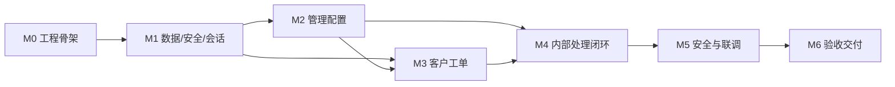

# 企业售后工单系统 MVP 实施计划

| 项目 | 内容 |
| --- | --- |
| 文档版本 | v1.0（已确认版） |
| 适用范围 | 最小可行产品（MVP）开发、联调与验收交付 |
| 文档阶段 | 开发前实施策划 |
| 编制日期 | 2026-05-28 |
| 当前状态 | 已经用户确认，作为 MVP 开发执行计划；项目可进入 `M0` 工程初始化与运行骨架 |

## 1. 文档目的

本文档依据已经确认的产品、需求、设计、测试验收及低保真页面结构基线，定义企业售后工单系统 MVP 的开发顺序、工程结构、任务分解、里程碑、质量门槛、交付物与风险控制方式。计划目标是在不扩大 MVP 范围的前提下，完成一个本地可运行、可演示、可测试的小规模售后工单闭环系统。

本计划确认后，项目可以进入代码初始化与迭代开发。实施中如发现需求、接口、数据模型或验收标准需要改变，应先形成变更说明并获得确认，再调整实现或本计划。

## 2. 实施依据

| 文档 | 实施用途 | 状态 |
| --- | --- | --- |
| `docs/00-项目基线与记录/企业售后工单系统-产品与技术规范-v1.0.md` | 产品与技术总体边界 | 已确认 |
| `docs/01-需求分析/01-产品需求文档-PRD.md` | MVP 范围、角色价值及验收目标 | 已确认 |
| `docs/01-需求分析/02-软件需求规格说明书-SRS.md` | 业务规则、权限、安全与非功能需求 | 已确认 |
| `docs/01-需求分析/03-页面与交互说明.md` | 页面清单、导航与交互表现 | 已确认 |
| `docs/01-需求分析/04-低保真页面原型设计-讨论稿.md` | 页面结构、信息顺序与前端实现辅助基线 | 已确认采用 `A 线性流程型` |
| `docs/02-系统设计/01-技术设计说明书.md` | 架构、分层、安全、持久化与部署约束 | 已确认 |
| `docs/02-系统设计/02-数据模型设计.md` | 实体、约束、历史快照与 JSON 模式 | 已确认 |
| `docs/02-系统设计/03-API接口设计.md` | REST 路由、请求响应、权限及错误规则 | 已确认 |
| `docs/03-测试与验收/00-需求与设计追踪矩阵-一致性审查记录.md` | 需求与设计一致性结论 | 已确认，通过 |
| `docs/03-测试与验收/01-测试与验收方案.md` | 测试用例、端到端验收及退出准则 | 已确认 |

## 3. 实施目标与边界

### 3.1 MVP 交付目标

| 目标 | 交付表现 |
| --- | --- |
| 客户售后入口可用 | 客户可注册、登录、建单、查看本人详情并追加公开留言。 |
| 内部处理闭环可用 | 管理员可维护基础配置、分配工单；客服或管理员可处理并关闭工单。 |
| 权限和数据隔离成立 | 客户只访问本人资源，客服只处理本人负责工单，敏感字段不越界暴露。 |
| 数据可保存和追溯 | 业务数据、会话和操作记录保存于版本化 JSON 文件，重启后可读取。 |
| 技术演进边界清晰 | 应用服务通过仓储协议工作，未来可以替换为关系型数据库实现。 |
| 验收证据完备 | 自动化测试、人工端到端验收和已知限制记录满足已确认方案。 |

### 3.2 MVP 不实施内容

| 不实施内容 | 实施约束 |
| --- | --- |
| 附件、外部通知、SLA、统计报表 | 不建立页面入口、API 路由或数据字段作为正式功能。 |
| 高级搜索、多条件筛选、批量操作、导出 | 内部工单仅实现按单一状态筛选。 |
| 客户确认关闭、取消、回退、重开、自动关闭 | 仅实现线性内部关闭流程。 |
| 密码找回、多因素认证、验证码、登录锁定 | 不纳入 MVP 开发任务。 |
| 关系型数据库迁移、备份恢复、生产部署 | 仅保留可替换仓储边界，不实现正式运行能力。 |
| 多实例写入与高并发方案 | MVP 只支持一个应用进程写入一个 JSON 主数据文件。 |

## 4. 实施技术基线

| 类别 | 实施约束 |
| --- | --- |
| 应用形态 | 单体 Web 应用，由 `FastAPI` 同时提供 REST API 和静态页面。 |
| 前端方式 | 原生 `HTML`、`CSS`、`JavaScript` 多页面应用，不引入前端框架或构建链作为必要条件。 |
| API | 统一使用 `/api/v1` 前缀，分为 `/auth`、`/categories`、`/customer`、`/internal`、`/admin`。 |
| 页面结构 | 采用已确认的 `A 线性流程型`：多页面、单页面单主任务、顶部页头与角色导航、列表进入详情、详情集中展示状态与可执行操作。 |
| 后端分层 | 接口层、应用服务层、领域规则层、仓储协议层、基础设施实现层。 |
| 持久化 | 单个带 `schema_version` 的 `store.json`，通过仓储适配器访问。 |
| 写入安全 | 进程内写入锁与同目录临时文件原子替换；业务变更和必要操作记录一次提交。 |
| 身份认证 | 服务端会话；浏览器使用 `ticket_session`、`HttpOnly`、`SameSite=Lax` Cookie；固定 8 小时有效期。 |
| 密码安全 | 使用 `Argon2id` 哈希，不保存或输出明文密码。 |
| 管理员初始化 | 通过启动环境配置创建首个管理员；已有管理员后不重复创建或覆盖。 |
| 标识与时间 | 实体 ID 采用 UUID v4；持久化时间采用 UTC ISO 8601 字符串。 |
| 开发运行模式 | 本地单进程启动；数据文件不位于可由浏览器访问的静态目录中。 |

## 5. 工程初始化方案

### 5.1 计划目录结构

以下目录为实施起点。后端按 FastAPI 多模块 Python 包方式组织，使用 `pyproject.toml` 管理依赖和测试配置；本项目为本地运行应用而非可发布通用库，因此采用直观的 `backend/app/` 布局，不额外引入 `src/` 安装布局。

```text
enterpriseSpec/
  backend/
    pyproject.toml
    .env.example
    app/
      __init__.py
      main.py
      config.py
      api/
        __init__.py
        dependencies.py
        errors.py
        routes/
          __init__.py
          auth.py
          categories.py
          admin.py
          customer.py
          internal.py
      schemas/
        __init__.py
      services/
        __init__.py
      domain/
        __init__.py
      repositories/
        __init__.py
        protocols.py
        json_repository.py
      security/
        __init__.py
      storage/
        __init__.py
    data/
      .gitkeep
    tests/
      __init__.py
      unit/
      service/
      api/
      storage/
  frontend/
    pages/
      login.html
      register.html
      customer/
        tickets.html
        ticket-new.html
        ticket-detail.html
      internal/
        tickets.html
        ticket-detail.html
        categories.html
        agents.html
        customers.html
    assets/
      css/
        styles.css
      js/
        api-client.js
        session-ui.js
        form-utils.js
        ticket-ui.js
  docs/
  README.md
  .gitignore
```

| 目录/文件 | 职责 |
| --- | --- |
| `backend/pyproject.toml` | 后端项目元数据、运行/测试依赖和测试工具配置。 |
| `backend/.env.example` | 仅保存环境配置键与示例占位值，不包含真实密码或凭证。 |
| `backend/app/main.py` | 创建 FastAPI 应用、注册路由、提供静态资源、执行启动初始化。 |
| `backend/app/config.py` | 数据路径、管理员初始化、Cookie 等环境配置读取。 |
| `backend/app/api/` | HTTP 路由、请求上下文、统一错误与响应约束。 |
| `backend/app/api/routes/` | 按认证、分类、管理、客户工单和内部工单边界拆分 `APIRouter` 路由模块。 |
| `backend/app/schemas/` | API 请求与响应模型，确保字段暴露边界。 |
| `backend/app/services/` | 业务用例编排、权限检查调用与审计提交。 |
| `backend/app/domain/` | 状态规则、实体约束、权限判断等可独立测试逻辑。 |
| `backend/app/repositories/` | 仓储协议及 JSON 适配器。 |
| `backend/app/security/` | 密码哈希、会话随机值与摘要、认证辅助逻辑。 |
| `backend/app/storage/` | 初始化、原子读写、写入锁和文件模式处理。 |
| `backend/tests/` | 单元、服务、接口与存储自动化测试。 |
| `frontend/pages/login.html`、`frontend/pages/register.html` | 公共登录与客户注册页面。 |
| `frontend/pages/customer/` | 客户门户页面：我的工单、新建工单、客户工单详情。 |
| `frontend/pages/internal/` | 内部后台与管理员页面：工单列表、工单详情、分类管理、客服账号、客户账号。 |
| `frontend/assets/css/styles.css` | MVP 页面共享样式，遵循 `A 线性流程型` 的统一页头、导航、反馈区和内容区结构。 |
| `frontend/assets/js/` | API 客户端、会话导航、表单校验、工单状态与留言渲染等共享逻辑。 |
| `.gitignore` | 排除虚拟环境、缓存、本地配置、运行数据和测试临时数据。 |

### 5.2 开发依赖与配置任务

| 工作项 | 实施内容 | 产出 |
| --- | --- | --- |
| Python 项目环境 | 选择本地可稳定运行的受支持 Python 版本，并通过 `backend/pyproject.toml` 固定项目元数据、依赖与测试配置。 | `pyproject.toml`、环境说明、依赖锁定文件 |
| 运行依赖 | 引入 `FastAPI`、应用服务器、配置管理与 Argon2id 实现所需依赖。 | 可启动应用 |
| 测试依赖 | 引入 Python 测试工具和 FastAPI HTTP 测试客户端所需依赖。 | 可运行测试命令 |
| 配置约定 | 定义数据路径、管理员初始化值、Cookie 安全开关及应用启动设置；只提交占位示例。 | `backend/.env.example`、配置说明 |
| 数据隔离 | 演示数据与测试临时数据分离；禁止将真实会话原始值写入文档或日志。 | 测试隔离约定 |

具体包版本在代码初始化时锁定，以实际可运行且满足设计基线的组合为准；版本选取不得改变已确认的业务、安全和接口行为。

## 6. 开发方式与实施顺序

MVP 采用“基础能力先固化，按业务闭环纵向集成，测试随功能同步落地”的方式推进。优先实现数据约束、会话与授权基础，再完成管理员配置、客户建单和内部处理流程，最后进行页面联调与全面验收。这样可以在每个里程碑结束时得到可验证的增量，而不是在最后阶段才发现核心规则无法落地。

| 顺序 | 阶段 | 核心成果 | 完成门槛 |
| --- | --- | --- | --- |
| `M0` | 工程初始化与运行骨架 | 可启动 FastAPI 应用、静态入口、配置和测试框架 | 本地启动成功，基础健康检查/静态页可访问，测试命令可运行 |
| `M1` | 数据、仓储、安全与会话基础 | 数据模型、JSON 原子存储、密码哈希、会话、管理员初始化 | 存储/认证核心自动化测试通过 |
| `M2` | 管理基础配置能力 | 客服账号、客户启停、分类维护 API 与管理页面 | 管理用例和权限测试通过 |
| `M3` | 客户工单能力 | 注册登录、有效分类、建单、客户列表详情与留言页面/API | 客户主路径与客户越权测试通过 |
| `M4` | 内部处理闭环 | 内部列表、详情、分配、留言、状态推进和操作记录 | 负责人权限与状态闭环测试通过 |
| `M5` | 安全、交互与完整联调 | 字段隔离、XSS 文本呈现、反馈与确认、浏览器联调 | 所有关键 API/UI 场景完成 |
| `M6` | 验收准备与交付 | 全量测试、E2E 演示、说明文档和验收记录 | 测试方案退出准则满足并提交验收 |

## 7. 里程碑任务分解

### 7.1 `M0` 工程初始化与运行骨架

| 任务编号 | 任务 | 产出 | 验证 |
| --- | --- | --- | --- |
| `M0-01` | 建立后端、前端、测试和数据目录，以 `pyproject.toml` 初始化 Python 应用工程与测试配置。 | 工程目录、项目配置、依赖和运行命令 | 新环境可安装并启动 |
| `M0-02` | 建立 FastAPI 应用入口、静态资源挂载及按模块拆分的 `/api/v1` `APIRouter` 路由基础。 | 应用启动骨架、路由包结构 | 页面入口和基础 API 可访问 |
| `M0-03` | 建立配置加载、`.env.example` 和 `.gitignore`，定义数据文件与管理员初始化等配置字段。 | 配置模块、示例配置、忽略规则 | 缺失/有效配置表现可识别，敏感本地文件不纳入版本内容 |
| `M0-04` | 建立测试基础设施、临时数据路径和公共测试夹具。 | 测试命令、隔离夹具 | 测试不会污染演示数据 |
| `M0-05` | 建立前端静态目录、共享 CSS/JS 占位文件和基础页面访问路径。 | 前端目录骨架、占位入口 | 静态资源可由 FastAPI 同源访问 |

### 7.2 `M1` 数据、仓储、安全与会话基础

| 任务编号 | 任务 | 产出 | 验证重点 |
| --- | --- | --- | --- |
| `M1-01` | 实现用户、分类、工单、留言、操作记录和会话的数据结构与枚举。 | 领域/持久化模型 | UUID、UTC 时间、状态枚举、快照字段 |
| `M1-02` | 实现仓储协议以及 JSON 主数据文件读取、空库初始化和模式版本。 | 仓储接口、`JsonRepository` | `TC-DAT-001`、`006`、`007` |
| `M1-03` | 实现进程内锁、临时文件原子替换和组合业务写入能力。 | 存储提交机制 | `TC-DAT-003`、`004` |
| `M1-04` | 实现 Argon2id 密码创建与校验逻辑。 | 安全模块 | `TC-SEC-006` |
| `M1-05` | 实现服务端会话创建、验证、撤销、到期与 Cookie 配置。 | 认证依赖与会话仓储 | `TC-SEC-001`、`007`、`008` |
| `M1-06` | 实现首个管理员启动初始化流程及安全日志边界。 | 管理员引导机制 | `TC-AUTH-008` |

### 7.3 `M2` 管理基础配置能力

| 任务编号 | 任务 | 产出 | 验证重点 |
| --- | --- | --- | --- |
| `M2-01` | 实现管理员认证上下文和管理员路由授权依赖。 | 管理接口权限基础 | `TC-SEC-002` |
| `M2-02` | 实现分类列表、新增、编辑及启停服务和 API。 | `/admin/categories` 接口 | `TC-CAT-001` ~ `004` |
| `M2-03` | 实现有效分类查询接口。 | `/categories/active` 接口 | `TC-CAT-003` |
| `M2-04` | 实现客服账号列表和创建服务/API。 | `/admin/agents` 接口 | `TC-AUTH-009`、`010` |
| `M2-05` | 实现客户列表与启停服务/API，禁用后会话失效。 | `/admin/customers` 接口 | `TC-AUTH-011`、`012` |
| `M2-06` | 按 `A 线性流程型` 实现分类、客服账号、客户账号管理页面。 | `UI-ADM-01` ~ `03` | 反馈、确认、角色入口控制 |

### 7.4 `M3` 客户工单能力

| 任务编号 | 任务 | 产出 | 验证重点 |
| --- | --- | --- | --- |
| `M3-01` | 实现客户注册、登录、退出和当前身份接口与页面。 | `/auth` 接口、登录/注册页 | `TC-AUTH-001` ~ `007` |
| `M3-02` | 实现客户建单服务和 API，保存初始状态、分类快照和创建记录。 | `POST /customer/tickets` | `TC-TKT-001` ~ `003`、`TC-LOG-001` |
| `M3-03` | 实现客户本人列表与详情读取，隔离负责人和内部记录。 | 客户工单 GET 接口 | `TC-TKT-004`、`005`、`TC-SEC-004` |
| `M3-04` | 实现客户公开留言与关闭限制。 | 客户消息接口 | `TC-MSG-001`、`003`、`004` |
| `M3-05` | 按 `A 线性流程型` 实现我的工单、新建工单、客户详情页面。 | `UI-CUS-01` ~ `03` | 跳转、中文状态、客户展示边界 |

### 7.5 `M4` 内部处理闭环

| 任务编号 | 任务 | 产出 | 验证重点 |
| --- | --- | --- | --- |
| `M4-01` | 实现客服/管理员内部工单列表、详情和单状态筛选。 | 内部 GET 接口 | `TC-TKT-006`、`TC-UI-007` |
| `M4-02` | 实现管理员分配与重新分配服务，记录负责人变更。 | `PATCH /internal/tickets/{id}/assignment` | `TC-ASG-001` ~ `004` |
| `M4-03` | 实现内部公开留言权限。 | 内部消息接口 | `TC-MSG-002` ~ `004` |
| `M4-04` | 实现线性状态推进和关闭后写入限制。 | 状态接口 | `TC-STS-001` ~ `005` |
| `M4-05` | 按 `A 线性流程型` 实现内部列表和工单详情页面及角色操作控件。 | `UI-INT-01`、`02` | 负责人/管理员操作表现、记录展示 |

### 7.6 `M5` 安全、交互与完整联调

| 任务编号 | 任务 | 产出 | 验证重点 |
| --- | --- | --- | --- |
| `M5-01` | 统一错误响应和前端错误/成功反馈处理。 | API 错误模型、前端请求模块 | `TC-SEC-010`、`TC-UI-002` |
| `M5-02` | 核查所有请求响应字段与权限拒绝行为。 | 数据暴露复核结果 | `TC-SEC-001` ~ `005` |
| `M5-03` | 确保所有用户文本均以文本形式展示。 | 安全渲染实现 | `TC-SEC-009` |
| `M5-04` | 依据页面交互说明与低保真确认结论，补齐确认提示、空状态、排序、导航和无权限页面表现。 | UI 完整联调版本 | `TC-UI-001` ~ `008` |
| `M5-05` | 在 Chrome 和 Edge 上执行主流程浏览器验证。 | 浏览器验证结果 | `TC-UI-009`、`010` |

### 7.7 `M6` 验收准备与交付

| 任务编号 | 任务 | 产出 | 验证重点 |
| --- | --- | --- | --- |
| `M6-01` | 执行完整自动化测试，修复阻断缺陷并复测。 | 测试执行记录 | 全部关键用例通过 |
| `M6-02` | 执行五条端到端人工验收场景。 | 人工验收记录 | `E2E-01` ~ `E2E-05` |
| `M6-03` | 完成运行、配置、初始化和已知限制说明。 | `README` 或运行说明 | 用户可本地启动演示 |
| `M6-04` | 汇总需求覆盖、缺陷状态与验收结论。 | MVP 验收记录 | 满足 `EXIT-01` ~ `EXIT-06` |

## 8. 实施依赖与先后关系



| 依赖关系 | 原因 |
| --- | --- |
| `M1` 依赖 `M0` | 数据、认证和测试需要稳定应用与配置骨架。 |
| `M3` 依赖 `M2` 的分类能力 | 客户建单必须选择有效分类。 |
| `M4` 依赖 `M2` 和 `M3` | 内部处理必须已有客服账号及客户工单。 |
| `M5` 依赖核心业务完成 | 字段隔离、交互反馈和跨角色联调需要完整流程。 |
| `M6` 依赖全部开发完成 | 最终验收需覆盖完整系统与记录证据。 |

### 8.1 任务级依赖与关键路径表

下表用于指导实际编码顺序。若同一里程碑内存在并行空间，应优先完成关键路径任务，再实现依赖其结果的页面、接口或测试。

| 任务 | 前置依赖 | 直接阻塞对象 | 关键路径价值 | 验证方式 |
| --- | --- | --- | --- | --- |
| `M0-01` 工程目录与 Python 项目配置 | 无 | 全部后端代码、测试与运行命令 | 建立可持续开发的工程基础。 | 新环境安装依赖并运行基础测试命令。 |
| `M0-02` FastAPI 应用入口与路由骨架 | `M0-01` | 所有 API 路由、静态页面访问 | 确定应用启动、路由注册和同源静态资源边界。 | 健康检查、静态入口和空路由可访问。 |
| `M0-03` 配置与 `.env.example` | `M0-01` | 数据路径、Cookie、安全初始化、管理员初始化 | 让后续认证、存储和本地演示不依赖硬编码。 | 配置缺失、默认值和示例配置可识别。 |
| `M0-04` 测试基础设施 | `M0-01`、`M0-03` | `M1` 起所有自动化测试 | 保证后续每个业务能力都能同步验证。 | 测试夹具使用临时数据路径，不污染演示数据。 |
| `M0-05` 前端静态目录与共享资源占位 | `M0-02` | `M2`、`M3`、`M4` 页面实现 | 确认原生多页面前端的访问路径和共享资源组织。 | 前端占位页面和共享资源由 FastAPI 同源访问。 |
| `M1-01` 数据结构与枚举 | `M0-01`、`M0-04` | 仓储、服务、响应模型、状态规则 | 统一用户、分类、工单、留言、操作记录和会话的事实模型。 | 枚举、字段约束、UUID 与时间格式单元测试。 |
| `M1-02` 仓储协议与 JSON 空库初始化 | `M1-01`、`M0-03` | 所有保存与查询用例 | 建立业务服务与 JSON 文件之间的可替换边界。 | `TC-DAT-001`、`TC-DAT-006`、仓储协议测试。 |
| `M1-03` 写入锁与原子提交 | `M1-02` | 分类、建单、留言、分配、状态变更和审计记录 | 防止组合写入出现部分成功或 JSON 损坏。 | `TC-DAT-003`、`TC-DAT-004`。 |
| `M1-04` 密码哈希 | `M1-01` | 客户注册、登录、客服创建、管理员初始化 | 满足密码不明文保存的安全底线。 | `TC-SEC-006`。 |
| `M1-05` 服务端会话与 Cookie | `M1-02`、`M1-04` | 当前用户身份、所有受保护接口和角色导航 | 建立后端权限校验所需的登录身份来源。 | `TC-SEC-001`、`TC-SEC-007`、`TC-SEC-008`。 |
| `M1-06` 首个管理员初始化 | `M1-02`、`M1-04`、`M1-05` | 管理员登录、分类维护、客服创建 | 打通首次本地演示和后续后台配置入口。 | `TC-AUTH-008`。 |
| `M2-01` 管理员授权依赖 | `M1-05`、`M1-06` | 所有 `/admin` 接口和管理员页面 | 保证管理能力从第一项开始由后端强校验。 | `TC-SEC-002`。 |
| `M2-02` 分类管理服务/API | `M2-01`、`M1-03` | 有效分类查询、客户建单、分类管理页 | 客户建单前必须存在可用分类。 | `TC-CAT-001`、`TC-CAT-002`、`TC-CAT-004`。 |
| `M2-03` 有效分类查询 | `M2-02` | 新建工单页和建单接口校验 | 让客户只能选择启用分类。 | `TC-CAT-003`。 |
| `M2-04` 客服账号管理服务/API | `M2-01`、`M1-04` | 工单分配、内部处理闭环、客服账号页 | 内部处理必须有有效客服账号可分配。 | `TC-AUTH-009`、`TC-AUTH-010`。 |
| `M2-05` 客户账号启停服务/API | `M2-01`、`M1-05` | 客户禁用验收、客户账号页、会话失效规则 | 覆盖账号状态对登录和受保护操作的影响。 | `TC-AUTH-011`、`TC-AUTH-012`。 |
| `M2-06` 管理页面 | `M2-02`、`M2-04`、`M2-05`、`M0-05` | 管理员首次配置演示 | 将分类、客服创建、客户启停能力落到 A 线性流程型页面。 | 管理页面人工走查和 `TC-UI-001`、`TC-UI-002`、`TC-UI-005`。 |
| `M3-01` 认证接口与登录/注册页 | `M1-04`、`M1-05`、`M0-05` | 客户建单、角色导航、全部受保护页面 | 打通客户、客服、管理员进入系统的统一入口。 | `TC-AUTH-001` ~ `TC-AUTH-007`。 |
| `M3-02` 客户建单服务/API | `M2-03`、`M1-03`、`M3-01` | 我的工单、客户详情、内部列表和处理闭环 | 创建 MVP 的核心业务对象，产生待分配工单和创建记录。 | `TC-TKT-001` ~ `TC-TKT-003`、`TC-LOG-001`。 |
| `M3-03` 客户本人列表与详情读取 | `M3-02` | 客户门户页面、客户越权验收 | 确立客户资源隔离和负责人信息不暴露。 | `TC-TKT-004`、`TC-TKT-005`、`TC-SEC-004`。 |
| `M3-04` 客户公开留言 | `M3-03`、`M1-03` | 客户详情完整沟通能力、内部留言展示 | 支撑客户在未关闭工单中补充信息。 | `TC-MSG-001`、`TC-MSG-003`、`TC-MSG-004`。 |
| `M3-05` 客户门户页面 | `M3-01`、`M3-02`、`M3-03`、`M3-04`、`M0-05` | 客户端端到端路径 | 将注册、建单、查看、留言路径落到 A 线性流程型页面。 | `TC-UI-001` ~ `TC-UI-004`、`TC-UI-006`。 |
| `M4-01` 内部工单列表与详情读取 | `M2-04`、`M3-02`、`M3-03` | 分配、内部留言、状态推进、内部详情页 | 让客服和管理员可查看全部工单并进入处理上下文。 | `TC-TKT-006`、`TC-UI-007`。 |
| `M4-02` 分配与重新分配 | `M4-01`、`M2-04`、`M1-03` | 负责客服处理权限、状态推进权限 | 确定当前负责人，是客服处理权限的核心前提。 | `TC-ASG-001` ~ `TC-ASG-004`。 |
| `M4-03` 内部公开留言 | `M4-01`、`M4-02` | 内部详情沟通闭环、客户可见回复 | 验证负责人和管理员可沟通，非负责人不可写入。 | `TC-MSG-002` ~ `TC-MSG-004`。 |
| `M4-04` 状态推进与关闭限制 | `M4-01`、`M4-02`、`M1-03` | 完整工单闭环、关闭后只读、最终验收 | 实现 `待分配 -> 处理中 -> 已解决 -> 已关闭` 的核心流程。 | `TC-STS-001` ~ `TC-STS-005`。 |
| `M4-05` 内部列表和详情页面 | `M4-01`、`M4-02`、`M4-03`、`M4-04`、`M0-05` | 内部端到端处理演示 | 将查看、分配、留言、状态推进和记录展示落到 A 线性流程型页面。 | `TC-UI-001`、`TC-UI-004`、`TC-UI-005`、`TC-UI-007`。 |
| `M5-01` 统一错误与前端反馈 | `M2`、`M3`、`M4` 核心接口 | 所有页面的可理解错误和成功反馈 | 消除接口错误与页面反馈不一致问题。 | `TC-SEC-010`、`TC-UI-002`。 |
| `M5-02` 响应字段与权限复核 | `M2`、`M3`、`M4` 核心接口 | 安全验收和字段隔离 | 防止客户看到负责人、内部记录或敏感字段。 | `TC-SEC-001` ~ `TC-SEC-005`。 |
| `M5-03` 用户文本安全渲染 | `M3-05`、`M4-05` | 页面安全验收 | 确保标题、描述和留言不被当作脚本执行。 | `TC-SEC-009`。 |
| `M5-04` UI 完整联调 | `M2-06`、`M3-05`、`M4-05`、`M5-01` | 浏览器主流程验收 | 补齐确认提示、空状态、排序、导航和无权限表现。 | `TC-UI-001` ~ `TC-UI-008`。 |
| `M5-05` 浏览器验证 | `M5-04` | 验收准备 | 确认 Chrome 与 Edge 中核心闭环无阻断。 | `TC-UI-009`、`TC-UI-010`。 |
| `M6-01` 全量自动化回归 | `M5` 完成 | 人工验收和交付结论 | 在演示前发现阻断缺陷。 | 全部关键自动化用例通过。 |
| `M6-02` 五条端到端人工验收 | `M6-01` | 最终验收记录 | 覆盖管理员配置、客户建单、内部分配处理、禁用客户和重启读取。 | `E2E-01` ~ `E2E-05`。 |
| `M6-03` 运行说明和限制记录 | `M5` 完成 | 用户本地复现和交付使用 | 让系统可被稳定启动、配置和演示。 | 按说明在本地启动并完成管理员初始化。 |
| `M6-04` 验收汇总 | `M6-01`、`M6-02`、`M6-03` | MVP 交付 | 汇总覆盖、缺陷状态和验收结论。 | 满足 `EXIT-01` ~ `EXIT-06`。 |

## 9. API 与页面交付清单

### 9.1 API 交付清单

| 模块 | 接口 | 实施里程碑 |
| --- | --- | --- |
| 认证 | `POST /api/v1/auth/register`、`POST /api/v1/auth/login`、`POST /api/v1/auth/logout`、`GET /api/v1/auth/me` | `M3`，会话基础在 `M1` |
| 有效分类 | `GET /api/v1/categories/active` | `M2` |
| 分类管理 | `GET/POST /api/v1/admin/categories`、`PATCH /api/v1/admin/categories/{id}`、`PATCH /api/v1/admin/categories/{id}/status` | `M2` |
| 客服管理 | `GET/POST /api/v1/admin/agents` | `M2` |
| 客户管理 | `GET /api/v1/admin/customers`、`PATCH /api/v1/admin/customers/{id}/status` | `M2` |
| 客户工单 | `GET/POST /api/v1/customer/tickets`、`GET /api/v1/customer/tickets/{id}`、`POST /api/v1/customer/tickets/{id}/messages` | `M3` |
| 内部工单 | `GET /api/v1/internal/tickets`、`GET /api/v1/internal/tickets/{id}`、`PATCH /api/v1/internal/tickets/{id}/assignment`、`POST /api/v1/internal/tickets/{id}/messages`、`PATCH /api/v1/internal/tickets/{id}/status` | `M4` |

### 9.2 页面交付清单

| 区域 | 页面 | 结构要求 | 实施里程碑 |
| --- | --- | --- | --- |
| 公共页面 | 登录页、客户注册页 | 单表单主任务；登录成功按角色进入不同首页；注册成功返回登录页。 | `M3` |
| 客户门户 | 我的工单页、新建工单页、客户工单详情页 | 顶部客户导航；列表进入详情；详情展示状态、描述和公开留言，不展示负责人。 | `M3` |
| 内部后台 | 内部工单列表页、内部工单详情页 | 顶部内部导航；列表单一状态筛选；详情按概要、分配/状态、留言、记录顺序组织。 | `M4` |
| 管理后台 | 分类管理页、客服账号管理页、客户账号管理页 | 管理员专属导航；新增表单在列表上方；停用分类、禁用客户前确认。 | `M2` |

### 9.3 页面实现约束

| 约束 | 实施要求 |
| --- | --- |
| 统一页面框架 | 登录后的页面均包含系统名称、当前用户、当前角色、退出入口、角色可见导航、页面标题、反馈区和主体内容区。 |
| 单页面单主任务 | 每个页面只承载其 MVP 主任务，不加入统计、搜索、导出、附件或批量操作入口。 |
| 详情页信息顺序 | 客户详情优先展示状态、问题描述和公开留言；内部详情按概要、分配/状态、公开留言、操作记录组织。 |
| 权限表现 | 页面隐藏或禁用无权操作并提示原因，但不得替代后端权限校验。 |
| 反馈与确认 | 表单错误、保存成功、空状态、无权限、关闭工单、停用分类和禁用客户均需提供可理解反馈。 |
| 文本安全 | 标题、描述、留言等用户输入内容必须按普通文本渲染，不作为 HTML 执行。 |

## 10. 测试落地安排

测试不是最终阶段才集中补充的工作，每个实施里程碑应同时提交与其风险匹配的自动化测试。已确认的《测试与验收方案》仍是最终通过判据，本节用于确定在开发过程中的落地顺序。

| 里程碑 | 同步实现的测试重点 | 对应验收用例 |
| --- | --- | --- |
| `M0` | 启动、配置、临时测试数据隔离 | 测试进入条件 |
| `M1` | 数据约束、JSON 读写/原子提交、密码哈希、会话与管理员初始化 | `TC-DAT-*`、`TC-SEC-006` ~ `008`、`TC-AUTH-008` |
| `M2` | 管理接口权限、分类有效性、客服创建、客户启停 | `TC-CAT-*`、`TC-AUTH-009` ~ `012` |
| `M3` | 注册登录、客户建单与本人资源隔离、客户留言 | `TC-AUTH-001` ~ `007`、`TC-TKT-*`、`TC-MSG-001` |
| `M4` | 分配、负责人变更、内部留言、状态推进、操作记录 | `TC-ASG-*`、`TC-MSG-*`、`TC-STS-*`、`TC-LOG-*` |
| `M5` | 响应字段、错误码、脚本展示、页面反馈与浏览器流程 | `TC-SEC-*`、`TC-UI-*` |
| `M6` | 全量回归及业务验收 | `E2E-01` ~ `E2E-05`、退出准则 |

## 11. 里程碑完成标准

| 里程碑 | 完成判断 |
| --- | --- |
| `M0` | 应用可本地启动；目录与配置可支撑后续模块；测试框架可执行。 |
| `M1` | 安全、会话、持久化和管理员初始化基础可用；相关自动化测试通过。 |
| `M2` | 管理员能够完成分类、客服账号和客户启停管理；越权操作被拒绝。 |
| `M3` | 客户能够注册登录并创建、查看、留言于本人工单；越权读取被拒绝。 |
| `M4` | 管理员和负责人客服能够完成分配、留言与线性状态关闭闭环；记录可查。 |
| `M5` | 权限和字段隔离复核通过；核心页面与两种桌面浏览器操作无阻断。 |
| `M6` | 满足测试方案 `EXIT-01` 至 `EXIT-06`；可提交用户最终验收。 |

## 12. 实施风险与控制

| 风险 | 影响 | 控制措施 | 验证方式 |
| --- | --- | --- | --- |
| 业务服务直接读写 JSON | 后续无法替换数据库，测试困难。 | 首先定义仓储协议；服务仅依赖协议。 | 代码审查与 `TC-DAT-007` |
| 写入只保存部分数据 | 工单状态与审计记录不一致。 | 一次提交完整新数据，临时文件原子替换。 | `TC-DAT-003`、`004` |
| 权限只在页面控制 | 可通过请求越权访问或写入。 | 每个受保护接口在后端校验身份、角色和资源关系。 | `TC-SEC-001` ~ `005` |
| 敏感信息响应泄露 | 客户看到负责人/内部记录，或暴露凭证。 | 使用独立响应模型并执行字段复核。 | `TC-SEC-004` ~ `008` |
| 实现误纳入后续功能 | 延迟 MVP 或与基线冲突。 | 以非范围清单约束页面、API 和数据字段。 | 里程碑审查 |
| 单 JSON 存储被误用于多进程 | 数据文件竞争或损坏。 | 启动与运行说明明确仅单进程；不启用多工作进程写入。 | `TC-DAT-008` |
| UI 最后集中联调导致返工 | 核心页面行为偏离接口或权限规则。 | 各业务里程碑同步实现对应页面和接口测试。 | `M2` 至 `M5` 联调检查 |

## 13. 变更与质量管理

### 13.1 变更控制

| 变更类型 | 处理要求 |
| --- | --- |
| 不改变基线的工程细化 | 可在实施中执行，例如包目录命名、共享辅助函数或测试夹具组织。 |
| 影响页面行为、API、数据模型或验收标准 | 先说明影响并获得用户确认，更新相应正式文档后实施。 |
| 新增 MVP 非范围功能 | 不直接实施，作为后续迭代候选记录并另行决策。 |

### 13.2 质量门禁

| 门禁 | 要求 |
| --- | --- |
| 功能提交门禁 | 新增业务能力应附带对应的服务/API 自动化测试，或说明其仅为页面静态结构。 |
| 安全门禁 | 认证、授权、Cookie、密码或响应字段相关变更必须执行对应安全测试。 |
| 数据门禁 | JSON 模式或写入流程变化必须执行持久化、重启读取和失败原子性测试。 |
| 验收门禁 | 最终交付前必须执行完整自动化回归及五条端到端验收场景。 |

## 14. MVP 交付物

| 类别 | 交付物 |
| --- | --- |
| 可运行系统 | FastAPI 单体应用、原生前端页面与本地启动配置。 |
| 后端实现 | 路由、请求响应模型、服务、领域规则、仓储协议、JSON 适配器、安全及存储模块。 |
| 前端实现 | 公共、客户、内部和管理员页面及共享 CSS/JavaScript。 |
| 数据与配置 | 版本化 JSON 初始化机制、管理员初始化配置约定、示例配置与数据目录说明。 |
| 测试资产 | 自动化测试代码、测试运行命令、测试数据隔离方案。 |
| 使用说明 | 本地安装启动、配置管理员、单进程限制及功能边界说明。 |
| 验收证据 | 自动化执行记录、端到端验收记录、缺陷状态、需求覆盖复核和最终验收结论。 |

## 15. 开发启动前检查清单

| 检查项 | 当前状态 |
| --- | --- |
| 产品与技术规范已经确认 | 已完成 |
| PRD、SRS 和页面交互说明已经确认 | 已完成 |
| 技术设计、数据模型和 API 设计已经确认 | 已完成 |
| 需求与设计一致性审查通过 | 已完成 |
| 测试与验收方案已经确认 | 已完成 |
| 低保真页面结构方向已经确认 | 已完成，采用 `A 线性流程型` |
| MVP 实施计划已经确认 | 已完成 |
| 代码工程初始化 | 可进入 `M0` 工程初始化与运行骨架 |

## 16. 确认事项

以下内容已经用户确认，可作为 MVP 开发执行计划：

1. MVP 的技术实施边界、经审查修订后的 FastAPI/Python 工程结构与不实施内容是否准确。
2. `M0` 至 `M6` 的开发顺序、任务拆解、交付物和完成门槛是否适合本项目。
3. 已确认的 `A 线性流程型` 是否可作为前端页面实现的辅助基线。
4. 测试同步落地、质量门禁、风险控制和最终交付物是否可以作为开发要求。

## 17. 确认记录

| 日期 | 确认人 | 结果 | 备注 |
| --- | --- | --- | --- |
| 2026-05-27 | 用户 | 已确认部分修订 | 批准将工程结构补充为含 `pyproject.toml`、Python 包路由模块、`.env.example` 与 `.gitignore` 的现代 FastAPI 应用布局；本计划整体仍待定稿确认。 |
| 2026-05-28 | 用户 | 已确认页面结构方向 | 选择低保真线框 `A 线性流程型`，已纳入本计划的实施依据、页面交付清单和页面实现约束。 |
| 2026-05-28 | 用户 | 已确认 | 确认本文档可作为 MVP 开发执行计划，项目可以进入 `M0` 工程初始化与运行骨架。 |
